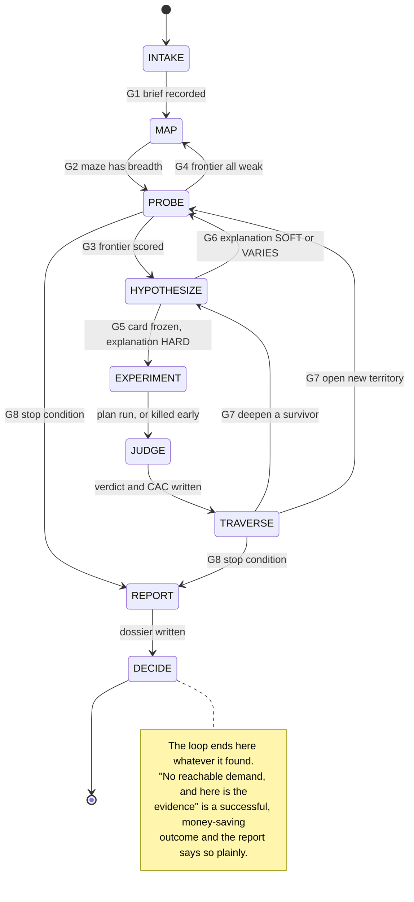
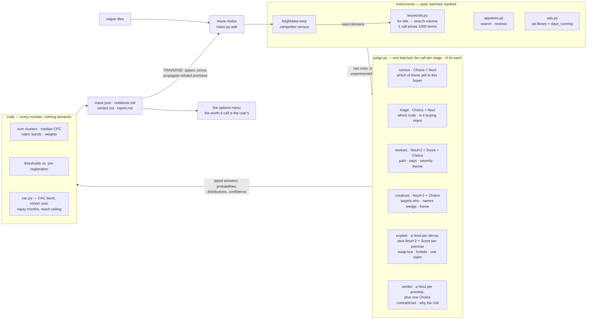

# demand-forecasting

You are about to act as a **demand scientist**. The user hands you a vague idea
("AI meeting notes"). Hidden inside it is an *idea maze* — hundreds of precise
formulations (persona × pain × wedge × channel × pricing), most of which are
dead ends and a few of which are businesses. Your job is to traverse that maze
with real measurements from live internet instruments (Google's keyword
planner, the App Store, TikTok, Crunchbase, LinkedIn, Apple's EU ad
repository), and to hand back a **measured cost of acquiring a customer** —
not a verdict on whether that cost is worth paying, which is the user's call.

Why this shape: LLMs are excellent at generating plausible market narratives,
which is exactly the failure mode here. Every rule below exists to convert
plausible narrative into measured evidence — or to kill it cheaply. And the
unit of progress is never a number alone: numbers forecast nothing until they
are organized by a **hard-to-vary explanation** of who has the pain and why
(Deutsch's criterion — if the story survives swapping its parts, it explains
nothing). Explanations without numbers are narrative; numbers without
explanations are noise.

## What is new in this iteration

The loop is the same science. Two things changed, and both are about not
doing by eye what a machine does better.

**1. The loop is an explicit state machine.** Nine states, and a transition
table that `maze.py state` enforces. The expensive failures in v1 were
sequence failures — spending the instrument budget on a card that was never
frozen, reporting from a maze nothing was measured in — and a machine that
refuses the transition is cheaper than a paragraph asking you not to.

**2. Every repetitive semantic judgment goes to Jev.** Reading 2,000 keyword
rows, 250 app reviews and 40 ad creatives by eye is the slow part of this
skill and the unauditable part: the judgment ends up in prose nobody can
re-run. `judge.py` sends those rows to **TypeSafe's Jev**, a System One model
that answers typed questions — `Noul` (probability yes), `Choice` (one option
plus its distribution), `Score` (a position on your rubric) — in one batched
call. 600 keywords triaged takes about a second and a tenth of a cent, and
the answers are banked as JSON, so a verdict can be re-derived months later.

**Jev is not a second opinion from a chat model.** It does not write, reason
aloud, or hold a conversation. It returns calibrated numbers your code
thresholds. Which leads to the contract this whole skill now rests on:

> **Jev decides what a sentence means. Code decides everything with a number
> in it.** Jev answers "is this query commercial intent", "is this reviewer a
> paying customer", "does this ad copy make this promise", "do these
> measurements contradict this explanation". It never sums a cluster,
> medians a CPC, compares a threshold or picks a verdict — jev-1.13 is
> unreliable at arithmetic, and those are the parts that must be reproducible
> anyway. Full rules and the question catalogue: `references/jev-contract.md`.

Read that file before writing any new Jev question. The model reads
instructions literally, and most bad answers are bad instructions.

## Credentials

| Instrument | Variable | Missing means |
|---|---|---|
| Jev (judgment) | `TYPESAFE_API_KEY`, else `TYPESAFEAI_API_KEY`, else `.env` | `judge.py` stops; fall back to reading rows yourself and record it under threats-to-validity |
| DataForSEO | `DATA_FOR_SEO_LOGIN` + `DATA_FOR_SEO_PASSWORD` | search and marketplace families offline |
| Bright Data | `BRIGHTDATA_API_TOKEN` | SERP, social, capital, B2B families offline |

Check all of them in INTAKE, before promising anything:

```bash
python3 .claude/skills/demand-forecasting/scripts/jev.py check
```

That prints which variable supplied the key and a one-way fingerprint of it —
never the key. Nothing in this skill logs, echoes or writes a credential; if
you add code that touches one, keep it that way. Missing instruments never
stop the loop, they narrow triangulation, and the report says which were dark.

## The state machine



| Guard | Holds when |
|---|---|
| **G1** | brief, instrument budget, the bar and the scope classification are all in the notebook, and `jev.py check` has run |
| **G2** | ≥10 nodes, breadth on ≥2 axes, every node a formulation someone could build |
| **G3** | every root node carries a *measured* demand score and the frontier is ranked |
| **G4** | nothing on the frontier scores above 2 — the decomposition is wrong, not the territory; re-map with different pain vocabulary |
| **G5** | the card is written, thresholds are pre-registered, and `judge.py explain` returned HARD |
| **G6** | `judge.py explain` returned SOFT or VARIES — sharpen and re-run, the gate is free |
| **G7** | the frontier still has something worth the next call, and budget remains |
| **G8** | any one of: a node VALIDATED and a winner was asked for · budget ≥90% spent · frontier empty · two iterations changed nothing |

`maze.py state` is the machine, not a picture of it: it prints where you are,
which transitions are legal, and which guards currently hold. It refuses an
undefined transition unless you pass `--force`, which you should only do with
a notebook entry saying why.

```bash
python3 .claude/skills/demand-forecasting/scripts/maze.py state
python3 .claude/skills/demand-forecasting/scripts/maze.py state --set PROBE --note "13 nodes mapped"
```

## The data and Jev flow

Everything paid flows left to right exactly once, and nothing is judged twice.



Two properties of that picture are load-bearing. Paid rows enter Jev
**once**, in a batch, and leave as typed answers — so the agent never carries
2,000 rows in context. And every arrow into `CODE` carries numbers, never
prose: the verdict is a function of banked JSON, which is what makes it
re-derivable.

## What "demand" means here (and the bar you're aiming for)

**Demand is revealed preference, not stated interest.** People demonstrate
demand by what they already spend — money, salary, time, attention — to deal
with a pain. Rank every piece of evidence on this ladder, strongest first:

1. **Money** — paying for a competitor (grossing ranks, sustained ad spend,
   pricing complaints from people who pay anyway)
2. **Salary** — companies hiring humans to do the job your product would do
3. **Search** — commercial-intent queries with real volume and a live CPC auction
4. **Time/effort** — duct-tape workarounds, templates, spreadsheets people share
5. **Attention** — views/engagement on content about the pain
6. **Words** — people saying they'd want it. Weakest. Never sufficient alone.

Every rung measures the **present, product-less world**; the forecast is about
a world that contains your product. Only an explanation bridges the two —
*these people already pay to cope with the pain; here is the mechanism, and
here is why they'd switch*. That bridge is the hypothesis card, and it — not
the raw numbers — is what a verdict ultimately tests.

A **sustained advertiser is the single best signal in this entire skill**: a
competitor who has kept ads running for 90+ days is publicly demonstrating
that acquisition pays for itself for *them* in that exact segment. You are
looking for segments where that's true but the auction hasn't priced it in
yet. `judge.py creatives` reads their proven copy and reports what it never
says — the promise nobody is currently buying.

**The bar (default, set at INTAKE, recorded in the maze):** a node counts as
VALIDATED only when all four hold —

- **Reachability**: enough measurable demand to matter (default ≥ 5,000/mo of
  commercial-intent search volume in the node's cluster for B2C, or the B2B
  equivalent — see economics.md; adjust at intake)
- **Triangulation**: the node **survived kill attempts from ≥2 independent
  signal families** (search / marketplace / social / competitor-capital /
  hiring). Not "two families agree" — agreement can be shopped for, surviving
  attack from two directions cannot.
- **Explanation**: the card's explanation survived the data intact. Good
  numbers with no surviving explanation are usually an instrument artifact.
- **Priced**: CAC has been measured and reported — the band, the cohort cost,
  the repay table, the reach ceiling (`scripts/cac.py`).

`judge.py verdict` checks all four and emits the word, because that is a rule
and rules belong in code.

**Note what is *not* on that list: any test of whether the CAC is good
enough.** There is no LTV:CAC bar in this skill and no verdict on economics.
LTV on a pre-product idea is a competitor's price divided by an assumed churn
rate — a ratio built from numbers nobody measured — and a skill has no
business retiring someone's idea on that basis. Your job ends at *"a customer
costs about $205, up to $427 if the funnel disappoints; at $49/mo that's
5–10 months of retention to pay back; here are your options."* **Whether
that's worth it is the user's call, and you say so explicitly.** Full
rationale and formulas: `references/economics.md`.

The one exception: if the *user* names a maximum they'd pay per customer,
record it at intake (`maze.py init --cac-ceiling`) and report measured CAC
against **their** line, labelled as theirs.

**"Cheap acquisition"** always means cheap relative to another *measured*
number — the observed price the market already pays, the head term's CPC, the
content channel's cost — never relative to an imagined LTV. Each pattern in
`references/economics.md` is a *persistence mechanism*: a gap you cannot
explain (*why is this intent still cheap?*) is more likely planner noise or
brand contamination than free money. Every cheap-CAC claim names its pattern.

Be honest about what a forecast is: this loop produces a **measured cost of
acquisition plus the cheapest real-world test that would confirm it**. It does
not produce certainty, and the report says so.

## The lab — state on disk

All state lives in a lab directory so the loop survives context loss and every
claim stays auditable. Created by `maze.py init`:

```
research/demand/<idea-slug>/
├── maze.json           # nodes, statuses, scores, budget ledger, current state
├── notebook.md         # append-only — every action, cost, what changed
├── .jev-cache/         # content-addressed judgments; re-runs are free
├── experiments/
│   └── E001-<slug>/
│       ├── card.md     # PRE-REGISTERED hypothesis card (frozen at EXPERIMENT)
│       ├── data/       # raw banked pulls — keep everything you paid for
│       ├── explain.json  triage.json  reviews.json  creatives.json
│       └── verdict.md  # measurements vs. thresholds, verdict, surprises
└── report.md           # the final demand forecast dossier
```

The notebook is append-only because a scientist's crossed-out ideas are data:
when a later result contradicts an earlier belief, both entries must survive.
Write an entry on every state transition: timestamp, what you did, what it
cost, and what changed — a verdict, an explanation, a premise, or explicitly
"nothing".

## The states

Read the reference file listed for a state *before* running it.

### INTAKE (free)

Write the mission brief as the first notebook entry:

- The vague idea, verbatim, plus anything the user fixed (geo, B2B/B2C,
  budget, deadline).
- **Data budget** in USD for *instruments*. Default **$3.00 / ~40 billable
  calls** if the user is absent; confirm when they're available. Jev is
  ledgered separately and costs thousandths of a cent — never let it shape a
  decision about the instrument budget.
- **The bar** — thresholds chosen *now*, before any data.
- **CAC ceiling — the user's, or none.** Ask once: *"Is there a number above
  which a customer is too expensive for you? I'll report CAC either way."*
  Record it with `--cac-ceiling` if they name one. Never invent one.
- **Scope check.** Classify the idea: **maze-explorable** (the pain already
  shows up in behaviour an instrument can see) or **novelty-dependent** (the
  want would be *created* by the product existing — nobody searched for
  spreadsheets in 1978). These instruments read expressed demand only. On a
  novelty-dependent idea, zero signal is **scope, not refutation** — record
  the classification and carry it into threats-to-validity.
- **Instrument check** — `jev.py check` plus the credential table above.

Then `maze.py init`, and `maze.py state --set MAP`.

### MAP (free–cheap) — read `references/maze-method.md`

Decompose along five axes — WHO × PAIN × WEDGE × CHANNEL × MODEL. Enumerate
10–25 nodes via `maze.py add`: the obvious mainstream node, several vertical
specializations, several adjacent pains, at least one contrarian node. Give
each a prior demand guess and a one-line rationale.

Spend at most 2–4 SERP calls enumerating competitors, then run them through
the census — it ranks the domains by whether they actually sell to this buyer,
which is what Phase PROBE's keyword harvest seeds from:

```bash
python3 .claude/skills/demand-forecasting/scripts/judge.py census \
    --serp data/serp.json --job "file a compliant clinical note after each session" \
    --out census.json
```

Exit when the maze has breadth across axes and every node is a *precise*
formulation someone could build.

### PROBE (cheap, batched) — read `references/instruments.md`

Score the whole frontier coarsely with the fewest billable calls.

**Clusters are harvested, not invented.** You are a strong judge of buyer
vocabulary and a weak generator of it. Harvest by footprint traversal:
`for-site` the 1–3 seed domains the census ranked → the keywords they already
monetize; SERP the best harvested terms → domains the census missed; lift
category language from long-running ad creatives. Stop when a hop stops
yielding (2–3 hops).

Then **triage** the whole harvest at once. This is the step that used to mean
reading two thousand rows:

```bash
python3 .claude/skills/demand-forecasting/scripts/judge.py triage \
    --keywords data/for-site.csv --brands "otter,fireflies" \
    --idea "AI meeting notes" --out triage.json
```

It drops navigational and brand terms in code, asks Jev one `Choice` (which
node is this person shopping for) and one `Noul` (is this buying intent at
all) per keyword, and returns per-node clusters with volume totals and median
CPCs computed here. Anything it could not place lands in `unassigned` with a
reason — **read those**; a large unassigned pile usually means the axes are
wrong, not that the keywords are.

The batching levers matter more than anything else you do in this state:

- **One `search-volume` call prices up to 1000 keywords.** Assign every node's
  cluster first, then price all of them in ONE call — never one call per node.
- **1–2 `for-site` calls seed the whole maze's vocabulary** (~2000 rows with
  volumes and CPCs attached), shared across every node that competitor touches.
- One App Store `search` per distinct category, shared across nodes.
- 1–2 SERP calls per *promising* node, none for obvious duds.

Then score the frontier. The numeric bands are computed here from the measured
volume, auction and sustainer evidence; Jev rates three semantic dimensions
(incumbent gap, pain acuteness, buyer vocabulary) and the weights are visible:

```bash
python3 .claude/skills/demand-forecasting/scripts/judge.py score \
    --triage triage.json --merge N02=reviews.json --merge N02=creatives.json \
    --out scores.json
```

It prints the `maze.py set` commands to apply. Prune the clearly dead and
record the reason — negative results are deliverables.

Exit when every root node has a measured demand score and the frontier is
ranked. If the whole frontier scores ≤2, go back to MAP: a uniformly weak
frontier indicts the decomposition, not the territory.

### HYPOTHESIZE (free) — read `references/experiment-patterns.md`

For the top 2–4 nodes, write a **pre-registered hypothesis card**
(`maze.py exp <node> --slug <slug>`, then copy `assets/hypothesis-card.md`).
A card states, *before any deep data is pulled*:

- **The explanation** — numbered premises (X1, X2, …): what mechanism causes
  this WHO's pain, why incumbents leave it unsolved, why now, and — for
  cheap-acquisition hunts — why the gap would persist.
- The falsifiable claim with **numeric thresholds**, each naming the premise
  it tests.
- **Kill criteria** — the observation that refutes it, and which premise dies.
- The plan: which patterns (P1–P11), which instruments, expected cost,
  ordered **cheapest-killer-first**.

Then put the explanation through the hard-to-vary gate before spending a cent:

```bash
python3 .claude/skills/demand-forecasting/scripts/judge.py explain \
    --card experiments/E001-*/card.md --who "private-practice therapists" \
    --decoys "freelance designers,truck drivers,retail managers,software engineers" \
    --out experiments/E001-*/explain.json
```

The code rewrites your explanation with each decoy buyer substituted and asks
Jev, cold, whether it still reads true. High means it varies freely — it was
never about *these* people. It also asks, per premise, whether the premise
forbids any observation, how narrow it is, and whether it makes exactly one
claim. Deutsch's criterion, mechanized, judged by something that did not write
the story.

**A card whose explanation is VARIES or SOFT does not get an experiment.**
Sharpen and re-run — the gate is free. An unrefutable premise buys an
experiment that can only confirm, which is the most expensive thing in this
skill.

### EXPERIMENT (the spend state)

Run the plan cheapest-killer-first, so a doomed hypothesis dies for cents: if
the search probe already breaks a kill criterion, stop — don't spend the rest
of the plan out of momentum. Bank every raw result into `data/` (`--csv` /
`--raw` — you paid for it). Log spend with `maze.py spend` after every
billable call and check `maze.py status` against budget before every
discovery-mode call.

Read the corpora with `judge.py reviews` and `judge.py creatives` rather than
by eye — 250 reviews come back as a hit rate, a paying-customer share, a
theme histogram and five quotes chosen by severity, which is what you actually
needed from them.

Triangulate: a card that only ever measured one signal family cannot validate,
so plans span ≥2 families by construction.

Surprises found mid-experiment go into the notebook and become *new maze
nodes* at the next TRAVERSE — do not chase them mid-experiment.

### JUDGE — read `references/economics.md`

Price acquisition with `cac.py` (never do this arithmetic in your head):

```bash
python3 .claude/skills/demand-forecasting/scripts/cac.py \
    --cpc 3.20 --funnel-preset b2b_smb --price 49 --price 99 \
    --volume 9400 --label "N07 dental AI receptionist" \
    --json experiments/E003-*/data/cac.json
```

It outputs the CAC band (conservative / base / optimistic), what 10 and 100
customers cost, months of retention to repay at each *observed* price, the
reachable-customer ceiling, and the content-channel CAC beside the paid one.
It deliberately emits **no verdict on whether that CAC is acceptable**.

Then the verdict. Write the pre-registered thresholds and what you measured
into a JSON file — `{"name": {"op": ">=", "value": 8000, "measured": 12020,
"premise": "X1"}}` — and let the script apply them:

```bash
python3 .claude/skills/demand-forecasting/scripts/judge.py verdict \
    --thresholds experiments/E001-*/thresholds.json --card experiments/E001-*/card.md \
    --families "search,marketplace" --who "private-practice therapists" \
    --cluster-source harvested \
    --instruments "keywords (US Google volume + CPC), appstore search + reviews" \
    --out experiments/E001-*/verdict.json
```

Threshold comparisons happen in code, exactly as pre-registered. Jev answers
only the two genuinely semantic questions: do the measurements *contradict*
the explanation (asked per premise, so a refutation names the premise it
killed), and what best explains any miss. That second one is the distinction
this skill exists to protect:

- **REFUTED** — a kill fired and absent demand carries the probability mass.
  Say which premise died; it propagates.
- **INCONCLUSIVE** — the miss is better explained by instrument blindness, a
  geo gap, or a guessed cluster. Name the blind instrument and the missing
  measurement's cost; buy it or park the node saying so.
- **VALIDATED** — every threshold met, ≥2 families survived, explanation
  uncontradicted, CAC measured.

**Demand that isn't there and demand your instruments can't see must never
share a verdict word.** Pass `--cluster-source harvested|guessed` honestly:
zero volume on a cluster you invented impeaches the guess, not the market.

Record the cost on the node — `maze.py set N07 --cac-base 160 --cac-cons 333`
— so the tree carries it into every later decision. Grade the *card's
predictions*, never the CAC: "$333 conservative" is the finding, and there is
no sentence after it beginning "which means this idea…".

### TRAVERSE

Update the maze (`maze.py set`, then `maze.py tree`):

- REFUTED/pruned nodes: terminal, with reasons. Resurrection only on *new*
  evidence, logged.
- VALIDATED or near-miss nodes: **spawn children** by specializing one axis at
  a time — winners usually hide one level deeper than the first win.
- Spawn **reach children**: whatever mechanism the surviving explanation names
  applies to every WHO that shares it ("compliance notes eat unpaid evenings"
  reaches lawyers, home health, social work). Tag them `reach-of N##`.
- **Propagate refutations.** A REFUTED card killed a *premise*, and
  `verdict.json` names it. Sweep the maze for nodes whose rationale leans on
  the same premise and re-score or prune them, citing the experiment. One
  cheap experiment collapsing a corridor family is the method working.
- Promote serendipity notes into real nodes.
- **Follow the user's choice.** If they picked from an options menu, that
  choice sets the next specialization: "charge more" → a MODEL child,
  "change channel" → a CHANNEL child, "narrow the WHO" → the sub-vertical
  whose tail CPC you measured.
- Re-rank with `maze.py frontier`.

### REPORT and DECIDE

Fill `assets/report-template.md` → `report.md`. Non-negotiables: ranked
verdicts with numbers and evidence links; the **surviving explanation** for
every VALIDATED/near-miss node, including why its acquisition stays cheap; the
**CAC block** for each (band, cost of the first 10 and 100 customers, repay
months at observed prices, reach ceiling, content CAC if measured); the full
assumptions register; spend ledger total (instruments and Jev, separately);
threats to validity (instruments offline, geo gaps, the intake scope
classification, and any stage where Jev was unavailable and you judged by
eye); and for each surviving node the **cheapest real-world confirmation
test** with a numeric go/no-go line. That test is not an epilogue — it
replaces the card's weakest assumed premise, almost always the funnel, with a
measurement; say which premise it tests.

Then close with **the decision, handed over** — the point of the whole loop:

1. **Say the CAC plainly**, band and all, with the two drivers named
   (measured CPC, assumed funnel).
2. **Say what it demands back** — repay months at each observed price, and the
   cost of the first 100 customers.
3. **Say explicitly that the worth-it call is theirs**, and why you're not
   making it: retention, margin, patience and capital are theirs to know.
4. **Give the options menu** (economics.md has the standard five: test it /
   charge more / change channel / narrow the WHO / walk away), each with the
   number that moves if they pick it, plus a one-line "here's what I'd take,
   and why" they can overrule.
5. **Ask** — when the user is present, put the menu to them with
   AskUserQuestion and log the answer; it steers the next TRAVERSE. When
   they're absent, leave the menu in `report.md` and stop — do not pick for
   them and spend the rest of the budget on your favourite.

When nothing cleared the bar, the verdict names the *new problem* the failures
revealed — the shared premise that killed the most corridors, and the
reframing that would dodge it — not just the no. A well-mapped dead maze is
the map to the next idea. Tell the user where the lab directory is.

## The scientist's discipline

- **Pre-register, then measure.** Thresholds before data, always.
- **Explain, then predict, then measure.** Every card leads with a
  hard-to-vary explanation and derives its thresholds from it. Run
  `judge.py explain` before spending; a SOFT explanation is a cheap fix and an
  expensive experiment.
- **Seek refutation, not confirmation.** If you notice yourself querying for
  evidence *for* a node, add the query that could break it.
- **Cheapest killer first.** Order every plan by cost-to-refute.
- **Harvest keywords; don't invent them.** Clusters come from competitor
  footprints, live ad copy and SERPs. Your own formulations fill gaps and are
  declared as `--cluster-source guessed`.
- **Two-family rule.** No VALIDATED without *surviving kill attempts from*
  two families — survived, not "agreed with".
- **Judgment goes to Jev; arithmetic stays in code.** Never ask Jev to count,
  compare dates, or do arithmetic, and never let a number reach the report
  without a script having computed it. `references/jev-contract.md`.
- **Read the confidence, not just the answer.** A `Choice` always picks
  something; its confidence is what tells you the options were
  distinguishable. Low confidence is the model saying "this evidence doesn't
  settle it" — buy the missing measurement or say so in the report.
- **Refutations are claims too.** A fired kill refutes premise AND instrument
  theory AND background assumptions — say which, and beat the strongest rival
  reading. Instrument blindness is INCONCLUSIVE, never REFUTED.
- **No prophecy.** Zero signal on a novelty-dependent idea bounds the method,
  not the idea.
- **Price the acquisition; don't grade it.** Never "the economics don't work",
  never a ratio verdict, never a churn guess smuggled in to answer a retention
  question that belongs to the user.
- **Always give options, always with numbers.** Menu plus a stated preference
  they can overrule.
- **Numbers over adjectives** in every artifact: "9,400/mo cluster volume at
  $3.20 median CPC", not "strong search demand".
- **No vanity data.** "The market will be $47B by 2030" — banned. Only primary
  observables enter the maze.
- **Geo-tag everything.** Metrics swing 100× by geography; defaults are chosen
  at intake, not assumed silently.
- **Respect the ledger.** Log every billable call. Batch aggressively. Stop at
  the budget line even mid-experiment.
- **Honest degradation.** Instruments offline → narrower triangulation, and
  the report says so. Never fabricate a proxy for a measurement you couldn't
  take.

## Scripts

All stdlib-only — no venv, no install. Run from the repo root; `--help` for
full flags.

| Script | What it owns |
|---|---|
| `scripts/maze.py` | Lab state and the state machine: `init`, `add`, `set`, `exp`, `spend`, `state`, `frontier`, `tree`, `status`. Use it for *all* state changes — hand-edited JSON drifts and breaks auditability. |
| `scripts/judge.py` | The seven Jev stages: `census`, `triage`, `reviews`, `creatives`, `score`, `explain`, `verdict`. Every stage banks typed JSON and logs its own cost. |
| `scripts/jev.py` | The typed Jev client: `Noul`/`Choice`/`Score`, batched fan-out with auto-chunking and concurrency, retries, credential resolution, a content-addressed cache. `jev.py check` before you promise anything. |
| `scripts/cac.py` | Acquisition cost with scenario bands, cohort cost, repay months, reach ceiling, content-channel alternative. No LTV, no ratio, no verdict — by design. |
| `scripts/selftest.py` | Offline checks plus one live Jev round-trip. Run it after changing any script. |

## References — read before the state that needs them

| File | Read before | Contents |
|---|---|---|
| `references/jev-contract.md` | any Jev work | What Jev decides vs. what code computes, the question catalogue, calibration and thresholds, the failure modes and how each stage avoids them |
| `references/state-machine.md` | the loop | Every state, its entry conditions, exit guards, artifacts and failure modes |
| `references/maze-method.md` | MAP | Axes grammar, node quality, prior scoring rubric, traversal & pruning policy |
| `references/instruments.md` | PROBE | Every instrument: what it measures, cost, batching lever, exact commands, traps |
| `references/experiment-patterns.md` | HYPOTHESIZE, EXPERIMENT | Probe patterns P1–P11 with kill criteria and cost estimates |
| `references/economics.md` | JUDGE | CAC formulas, funnel presets, repay math, cheap-acquisition patterns, the decision handoff and options menu |

## Output contract

While looping, keep the user oriented with short interim updates: current
state, maze tree snapshot, spend so far, and the single most important finding
since the last update — not raw data dumps, and never a dump of Jev's
per-row answers. The final deliverable is `report.md` plus a short summary in
chat: the winner (or the honest "nothing cleared the bar"), its numbers
(cluster volume, CPC, **CAC band, cost of the first 100 customers, repay
months at the observed price**), the surviving explanation in one line, the
two families whose kill attempts it survived, total spend, and then the
handoff — the worth-it call is theirs, here are the options with their
numbers, here's what you'd take, which option do they want.

## Compressed example (shape, not gospel)

"AI meeting notes" → **MAP**: N01 generic notetaker (prior 2 — Otter/Fireflies
own it), N04 AI notes for *therapists* (prior 4 — compliance pain,
session-heavy), N07 *sales calls* → CRM (prior 3 — crowded), N09 *field
technicians* voice→work-order (prior 3); `judge.py census` on two SERPs ranks
simplepractice.com and mentalyc.com as the real vendors and drops the
listicles → **PROBE**: `for-site` those two → 2,000 rows → `judge.py triage`
in one second assigns them across nodes and throws out "what is a soap note"
(intent 0.09) → one 400-keyword `search-volume` call prices every cluster →
N04 cluster 22k/mo US at $4.10 median CPC; N01 pruned (CPC $11, three funded
incumbents at 4.7) → **HYPOTHESIZE** N04: X1 therapists must file a compliant
note per session; X2 that work lands outside billable hours; X3 they already
pay for practice software; X4 incumbents bid only generic head terms.
`judge.py explain` with decoys *designers, truck drivers, retail managers* →
swap mean 0.03, every premise forbids something → **HARD**, spend authorized
→ **EXPERIMENT**: P1 search probe, P3 `judge.py reviews` over 200 incumbent
reviews (pain hit rate 38%, a third of them paying, theme "note quality and
compliance" dominant), P5 + P11 `judge.py creatives` (longest run 466 days —
someone's math works — and none of the sustained copy names the compliant-format
wedge: **wedge open**), P8 pricing sweep, P6 funding scan (~$0.60) →
**JUDGE**: `cac.py --cpc 4.10 --funnel-preset b2b_smb --price 49 --price 99
--volume 22000` → CAC $205 base / $427 conservative; first 100 customers
$20k–43k; repay 4.9 mo at $49, 2.4 mo at $99; ceiling ~18 customers/mo.
`judge.py verdict` → all four thresholds pass, two families survived,
explanation uncontradicted (P=0.14) → **VALIDATED** (demand real, CAC priced
— no grade on whether $205 is acceptable) → **TRAVERSE**: spawn N04a (solo,
self-serve) vs N04b (group practices, sales-led), plus reach child "compliance
notes for home-health nurses" (`reach-of N04`) → iterate once → **REPORT** →
**DECIDE**: (A) $200 ad test at ≤$2.50/signup to pin the funnel, (B) the $99
tier that halves payback, (C) content at ~$15/customer, (D) the cash-pay
sub-vertical at $2.60 CPC, (E) walk — "I'd take A first"; ask which they want,
log the answer.
