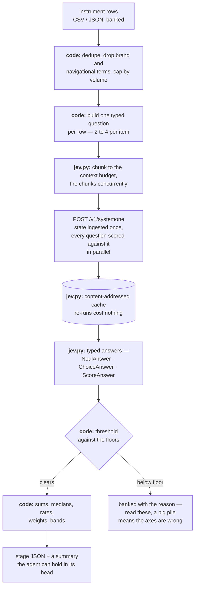

# The Jev contract — what the model decides, what the code decides

Read this before writing or changing any Jev question. Most wrong answers
from Jev are wrong questions, and the fix is almost always in the
`instructions`, not in a threshold.

## What Jev is

Jev is TypeSafe's **System One** model: it makes fast, structured judgments
for software. It does not generate text, explain itself, or hold a
conversation. You send a `state` and a map of typed questions; it returns one
typed answer per question.

```
POST https://api.typesafe.ai/v1/systemone
Authorization: Bearer <key>
{"state": …, "model": "jev-latest", "questions": {"<id>": {"type": …}}}
```

| Type | You give | You get back | Use it for |
|---|---|---|---|
| `Noul` | a yes/no question, optional `true`/`false` criteria | `noul`: P(yes) in 0–1. **No confidence field** — the probability *is* the answer | an absolute test that can be false of everything |
| `Choice` | 2–255 options, each with a rubric | `choice`, `probabilities` over all options (sum 1), `confidence` | picking one of a known set |
| `Score` | 2–10 ordered levels | `score` (a probability-weighted position, lands between levels), `legend`, `probabilities`, `confidence` | rating on a rubric, for ranking and thresholding |

`scripts/jev.py` wraps all of this: dataclasses for the three question types,
auto-chunking to stay inside the context budget, concurrent chunks, retries
with backoff on 429/529, and a content-addressed cache.

## The division of labour

This is the rule the whole skill rests on.

> **Jev decides what a sentence means. Code decides everything with a number
> in it.**

| Goes to Jev | Stays in code |
|---|---|
| Is this query someone shopping for a tool? | Summing a cluster's volume |
| Which node is this person shopping for? | The median and max CPC |
| Does this page belong to a vendor selling to this buyer? | Ranking domains by hit count |
| Does this review describe this pain? Does this reviewer pay? | The hit *rate*, the paying share |
| How badly does this cost them? (a rubric position) | The mean severity across reviews |
| Does this ad copy promise this wedge? | `days_running ≥ 90`, the sustained count |
| How much room do incumbents leave? | The 0–5 volume bands, the blend weights |
| Would this explanation still read true of a different buyer? | The mean across decoys, the verdict |
| Do these measurements contradict this premise? | `measured >= threshold`, and the verdict word |
| What best explains a null result? | Whether P(demand_absent) clears the refute floor |

Three reasons this line is where it is, and none of them is taste:

1. **jev-1.13 cannot do arithmetic.** It does not count reliably, it reads
   dates as text rather than ordered quantities, and its Score levels are not
   numerically calibrated — you may threshold a score, never interpolate a
   real-world quantity out of one.
2. **Numbers must be reproducible.** A verdict derived in code from banked
   JSON can be re-derived a year later. A verdict derived in a model's head
   cannot be checked at all.
3. **A model asked to do both does neither well.** Every question that hides a
   calculation inside a judgment gets a worse judgment.

## Choice vs. Noul — the distinction that matters most

A `Choice` is **relative**: its probabilities sum to 1, so it always picks
something, even when nothing fits. A `Noul` is **absolute**: it can be low
for every candidate.

`triage` asks both about every keyword, on purpose:

- `Choice` over the maze nodes plus an explicit `none_of_these` — settles
  *which* node, and its confidence says whether the nodes were even
  distinguishable by that query.
- `Noul` on commercial intent — settles whether it is a buying query *at
  all*, which no Choice over nodes could ever say.

Collapse those into one question and you get a cluster full of "what is a
soap note". Keep them apart and the code can drop a keyword for the right
reason, and say which.

Do **not** carry a threshold tuned on a Noul over to a Choice, and do not
expect `P(noul)` and `1 − P(negated noul)` to agree. They are different
questions to this model, and it does not guarantee the identity.

## Confidence, and when to use probability instead

`confidence` collapses the shape of the probability distribution into 0–1:
all the mass on one outcome is 1.0, an even spread is 0.0. It answers *"were
the options distinguishable?"* — which is the right question when you are
deciding whether to act on the pick at all.

It is the **wrong** question when you care about one specific option. A thin
spread across four instrument-failure options with a peak on absent demand,
and a two-way tie between two of them, can carry the same confidence and
demand opposite decisions. So `judge.py verdict` routes REFUTED on
`probabilities["demand_absent"]`, not on `confidence`:

```python
p_absent = why.probabilities.get("demand_absent", 0.0)
if why.choice == "demand_absent" and p_absent >= args.refute_probability:
    verdict = "REFUTED"
```

Rule of thumb: **confidence gates whether to act; a named option's
probability gates which way.**

Thresholds scale with what a wrong answer costs. In this skill:

| Floor | Where | Why there |
|---|---|---|
| 0.50 | keyword → node assignment, SERP classification | cheap to revisit next PROBE |
| 0.50 | pain hit, paying, wedge named | feeds a rate, and one row does not move a rate |
| 0.50 | explanation contradicted, premise contradicted | a card is cheap to sharpen |
| 0.60 | P(demand_absent) before REFUTED | retiring an idea is expensive and hard to undo |

When a Score or Choice comes back below its floor, that is the model saying
*this evidence does not settle it*. That is information: buy the missing
measurement, or write it into threats-to-validity. It is never a reason to
re-ask the same question hoping for a different number — Jev is consistent,
and you will get the same one.

## Writing questions that work

**Be literal.** Jev answers the question you wrote, not the one you meant.
When you look at a wrong answer and find yourself explaining what you really
meant, that explanation is the missing half of the instruction.

This skill's own worked example: `triage` first asked *"is this typed by
someone choosing or buying a product"* with `true` = "comparing tools,
checking pricing, or ready to buy". It scored `hvac work order app` at 0.49 —
correctly, since that query is neither comparing nor buying. Widening the
criterion to *"looking for a tool, app or software — browsing, comparing,
pricing, or ready to buy one"* moved it to where it belonged. The threshold
never changed; the instruction did.

**Use structured instructions.** Put the question in one field and the data
it refers to in others, then point at them in backticks:

```python
jev.Noul(
    instructions={"review": {"title": …, "text": …, "stars": …},
                  "pain": "having to rewrite AI output into a compliant note",
                  "question": "Does `review` describe the reviewer running into `pain`?"},
    criteria={"true": "The reviewer hit this specific problem",
              "false": "The review is about something else, or is generic praise"},
)
```

**Treat criteria as an extension of the instruction, not a contradiction of
it.** A Noul whose `true` maps to "no" performs worse. Keep them aligned and
readable.

**One judgment per question.** A question that hides two judgments returns an
answer to neither. This is also true of the *premises* `explain` reads, which
is why it asks a `single_claim` Noul per premise: a bundled premise survives
any single result, so no experiment can kill it.

**Keep the state small.** Accuracy falls as the state fills with material the
question does not need, so filter in code first. `jev.py` refuses a state over
the budget rather than sending a request that will answer badly.

**Give it the facts you already have.** `verdict` passes
`--cluster-source harvested|guessed` because the lab knows the answer and the
model would otherwise be speculating. With `guessed` declared, P(the keywords
were invented) went from 0.44 to 1.00 on the same numbers — the difference
between a coin flip and a decision.

**Never ask it to generate.** When the answer space is bounded, turn
extraction into a `Choice` over the options. When it is not, use a different
model.

## The anatomy of a stage



Every stage in `judge.py` has this shape. The two properties that matter: the
agent never holds the raw rows, and every number leaving the stage was
computed by the code above, not by the model.

## Cost, speed, limits

| | jev-1.13 |
|---|---|
| Price | $42 per billion input tokens ($0.042/Mtok). **Output tokens are free.** |
| Context | 64k for state + all questions; 32k for state + the single longest question |
| Rate limits | 250,000 tokens/sec, 1,200 requests/min (adjusting; `jev.py` retries with backoff and honours `retry-after`) |
| Choice options | 255 max |
| Score levels | 2–10 |
| Measured here | 240 questions over 120 keywords: **1.04s, $0.0013**, 4 concurrent chunks. Cached re-run: 0.01s, $0. |

Batching is not a micro-optimisation. TypeSafe measure one batched call at
**12x cheaper and 10x faster** than one call per question, with identical
answers — each question is scored against the state independently, so nothing
is lost by sending them together. Put every question a stage needs in one
`ask()` and let the code decide afterwards what was relevant.

## Credentials

`jev.py` resolves the key in this order, and stops at the first hit:

1. `TYPESAFE_API_KEY` — the name the official TypeSafe SDKs use
2. `TYPESAFEAI_API_KEY` — the name this environment provisions
3. either name in a `.env` in the working directory

The key is never printed, never logged, and redacted out of every error
message. `jev.py check` reports which variable supplied it plus a one-way
sha256 fingerprint, so two machines can confirm they are using the same key
without either revealing it. Keep it that way in anything you add.

No credential is ever written into `maze.json`, the notebook, a stage's JSON,
or the report.

## Adding a stage

1. Write the questions **atomically** — one judgment each — and decide for
   each whether it is relative (`Choice`) or absolute (`Noul`).
2. Put every number the stage needs in the code path, not the question.
3. Pick a floor per question and say in a comment what a wrong answer costs.
4. Bank the typed output as JSON with the thresholds that produced it, so the
   result can be re-derived.
5. Call `log_usage` so the Jev ledger stays honest.
6. Print a summary the agent can hold in its head — a rate, a count, five
   quotes. Never the rows.
7. Add a case to `scripts/selftest.py`.
