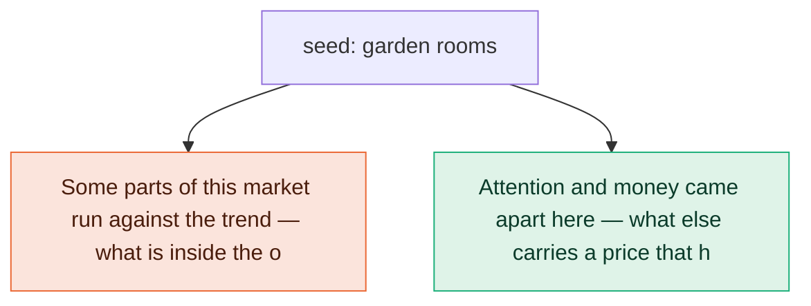

# What people actually search around “garden rooms”

**United Kingdom · 2026-09-22**

1,317 keywords measured, carrying 299,200 searches a month. 750 of them were placed on two axes — what the search is about, and what the person is trying to do — covering 100% of that searching. 13 statements the data could support were generated and tested; 4 survived.

Written for: *a UK garden room building company about to spend £4,000 on Google Ads and deciding which searches to bid on*. That matters — a finding is only valuable relative to the decision someone is about to make, so the same data judged for a different reader would keep a different set.

## What the data says

### 1. Attention and money are in different places here: the most-searched term is “garden rooms” (40,500/mo at $3.11 a click), while the dearest click is “vivid green garden rooms” (50/mo at $48.63).

- **most searched**: term garden rooms, searches 40500, cpc 3.11
- **dearest click**: term vivid green garden rooms, searches 50, cpc 48.63
- **keywords this rests on**: 642
- **monthly searches this rests on**: 281,430

**This rules out:** The busiest searches in this market are also the ones advertisers pay most to reach.

Searches behind it: `garden rooms (40,500/mo, $3.11 a click)`; `vivid green garden rooms (50/mo, $48.63 a click)`

*Jev — describes these searches: 0.50 · rules out the alternative: 1.00 · would not fit another market: 0.62 · not guessable without data: 0.82 · out of line for this kind of market: 0.35 · for the reader this is “A choice — it tells them which of two paths to take”*

### 2. The most seasonal part of this market is “glass room”, peaking in September at 5.2x its average month; across all 9 measured topics the median is 1.7x.

- **most seasonal topic**: glass room
- **peak month**: September
- **peak over mean**: 5.18
- **median peak over mean across topics**: 1.69
- **keywords this rests on**: 642
- **monthly searches this rests on**: 281,430

**This rules out:** This market is searched at much the same rate all year round.

Searches behind it: `outdoor glass room (590/mo, $3.43 a click)`; `glass room near me (90/mo, $7.44 a click)`; `glass room cost (50/mo, $2.15 a click)`; `glass room company (20/mo, $12.16 a click)`; `backyard glass room (10/mo, $3.85 a click)`; `glass room quote (10/mo, $0.00 a click)`

*Jev — describes these searches: 0.59 · rules out the alternative: 0.98 · would not fit another market: 0.97 · not guessable without data: 0.94 · out of line for this kind of market: 0.71 · for the reader this is “A choice — it tells them which of two paths to take”*

### 3. This market is shrinking: across 9 measured topics the last three months ran at 0.88x the same three a year earlier, and the exceptions run the other way — “sheds” at 1.21x.

- **market last quarter over year ago**: 0.88
- **topics measured**: 9
- **rising**: sheds 1.21x
- **falling**: glass room 0.22x, room in garden 0.34x, conservatory 0.70x, gym room 0.73x, insulated garden office 0.76x
- **keywords this rests on**: 642
- **monthly searches this rests on**: 281,430

**This rules out:** Demand across this market is roughly where it was a year ago, and moves as one.

Searches behind it: `garden rooms (40,500/mo, $3.11 a click)`; `rooms garden (40,500/mo, $3.11 a click)`; `the garden rooms (9,900/mo, $1.10 a click)`; `insulated garden rooms (6,600/mo, $4.33 a click)`; `garden rooms near me (2,400/mo, $6.55 a click)`; `garden rooms for sale (1,900/mo, $3.02 a click)`

*Jev — describes these searches: 0.84 · rules out the alternative: 1.00 · would not fit another market: 0.80 · not guessable without data: 0.94 · out of line for this kind of market: 0.36 · for the reader this is “A choice — it tells them which of two paths to take”*

### 4. Most of this market is people shopping for it (91% of 281,430 searches where the intent is clear), ahead of looking for someone nearby (6%).

- **intent mix**: buy 0.909, local 0.064, compare 0.013, learn 0.007, self_serve 0.005, brand_desk 0.003, career 0.0, fix 0.0
- **searches with clear intent**: 281,430
- **keywords this rests on**: 642
- **monthly searches this rests on**: 281,430

**This rules out:** What people are trying to do is much the same across every part of this market.

Searches behind it: `garden rooms (40,500/mo, $3.11 a click)`; `rooms garden (40,500/mo, $3.11 a click)`; `garden office (18,100/mo, $3.82 a click)`; `garden studios (14,800/mo, $3.80 a click)`; `the garden rooms (9,900/mo, $1.10 a click)`; `insulated garden rooms (6,600/mo, $4.33 a click)`

*Jev — describes these searches: 0.85 · rules out the alternative: 0.96 · would not fit another market: 0.88 · not guessable without data: 0.80 · out of line for this kind of market: 0.48 · for the reader this is “Colour — it fills in background they already assumed”*

## How this was arrived at

The loop makes one measurement, looks for what is out of line, and buys one answer to the question that raises. When an answer does not speak to the question, the branch is abandoned and a different thread is taken up — which is why the map below has ends that stop.

1. **Some parts of this market run against the trend — what is inside the ones that do?** → *dead end* — discarded 2,610 keywords it brought in; dropped 1 other question(s) of the same kind
2. **Attention and money came apart here — what else carries a price that high?** → *answered*

## The shape of the market

| what people search about | searches/mo | median click | names a brand | mostly trying to |
|---|---:|---:|---:|---|
| garden rooms | 154,090 | $1.77 | 0% | shopping for it |
| sheds | 31,650 | $1.06 | 0% | shopping for it |
| conservatory | 17,440 | $3.58 | 0% | shopping for it |
| garden studios | 16,300 | $0.00 | 0% | shopping for it |
| insulated garden office | 8,390 | $2.46 | 0% | shopping for it |
| garden buildings | 4,740 | $2.95 | 0% | shopping for it |
| gym room | 3,770 | $0.80 | 0% | shopping for it |
| glass room | 800 | $2.15 | 0% | shopping for it |
| room in garden | 100 | $1.45 | 0% | shopping for it |

## Checked, and it did not hold

Every statement the shape of the data permitted was built and tested, including ones that contradict each other. These are the ones that failed, and why — so you can see what was looked for as well as what was found.

**misread** — the numbers were right but the reading of them was not

- There is no spread to work with here: 1,317 keywords in total carrying 299,200 searches a month, and the five largest are 41% of all of it.
- In this market a click is priced by which part of the market they are in. Across intentions the median click runs $1.75–$2.95 (1.7x), dearest among people looking for someone nearby and cheapest among people choosing between options; across topics it runs $0.80–$3.58 (4.5x), dearest in “conservatory”.
- 6% of this market's 299,200 monthly searches do not reveal what the person wants — the words alone do not separate someone comparing tools from someone looking for a job or a free template. It is concentrated in the short, high-volume terms.
- The open ground is “garden rooms”: 100% of its 154,090 monthly searches name no company at all.
- The single largest search here is “garden rooms” at 40,500/mo, and those people are shopping for it.
- The competitor here is not a company but doing without: 1% of the searching with a clear intent is people trying to solve it without buying anything, heaviest in “sheds” at 3%.
- “glass room” and “room in garden” are weighed against each other: 1,600 monthly searches name both at once, led by “glass room in garden”.

**changes nothing** — true, specific, and of no consequence to the reader

- Narrowing the search changes who answers it: “garden rooms” is 40,500/mo at $3.11 a click, while “vivid green garden rooms” is 50/mo at $48.63 — 15.6x the price for 0% of the volume.

## What this cost

| | calls | actual |
|---|---:|---:|
| DataForSEO | 3 billable (+0 cached) | $0.2700 |
| Jev | 37 requests, 422,757 input tokens | $0.0178 |
| **total** | | **$0.2878** |

DataForSEO figures are the `cost` each response reported, not an estimate. Run time 34.0s.

## How to read this

Every sentence above was assembled by code from measured numbers, and every decision about it — does this describe these searches, does it rule anything out, could it have been guessed, does it matter to you — was made by a typed judgment model answering one question at a time. No language model wrote any of it, which is why the same keyword run twice returns the same report.

The two tests worth knowing about: a statement is **swapped** — its subject replaced with an unrelated one — and kept only if it then reads as false, because a statement that survives that substitution was never about this market. And it is asked whether it could be **guessed from the market's name alone**; if so, the data paid for nothing.

Search volume and click prices are Google Ads figures for United Kingdom. Volume is a monthly average, not a forecast; click prices are what advertisers have been paying, which is evidence that money moves — not a quote.
