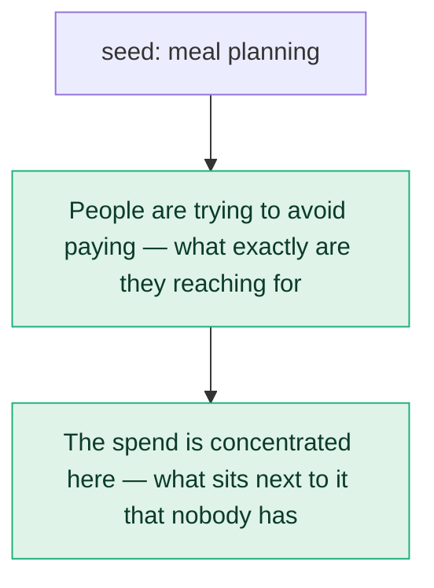

# What people actually search around “meal planning”

**United States · 2026-09-22**

4,271 keywords measured, carrying 5,285,880 searches a month. 750 of them were placed on two axes — what the search is about, and what the person is trying to do — covering 90% of that searching. 13 statements the data could support were generated and tested; 7 survived.

Written for: *a founder and her cofounder deciding whether to build a product in this space; they want hard numbers on whether real demand exists or whether it is a graveyard*. That matters — a finding is only valuable relative to the decision someone is about to make, so the same data judged for a different reader would keep a different set.

## What the data says

### 1. The competitor here is not a company but doing without: 39% of the searching with a clear intent is people trying to solve it without buying anything, heaviest in “meal ideas” at 100%.

- **self serve share**: 0.39
- **heaviest topic**: meal ideas
- **heaviest share**: 1.00
- **median cpc of self serve**: 1.51
- **keywords this rests on**: 587
- **monthly searches this rests on**: 3,525,100

**This rules out:** People in this market accept that solving the problem means paying somebody for it.

Searches behind it: `ketogenic diet meal plan (110,000/mo, $1.29 a click)`; `budget dinner ideas (49,500/mo, $0.53 a click)`; `calories deficit diet plan (49,500/mo, $2.13 a click)`; `mediterranean diet meal plan (40,500/mo, $2.16 a click)`; `meal ideas (40,500/mo, $0.51 a click)`; `mediterranean diet menu plan (40,500/mo, $2.16 a click)`

*Jev — describes these searches: 0.58 · rules out the alternative: 0.92 · would not fit another market: 0.86 · not guessable without data: 0.83 · out of line for this kind of market: 0.38 · for the reader this is “Colour — it fills in background they already assumed”*

### 2. Most of this market is people shopping for it (52% of 3,525,100 searches where the intent is clear), ahead of trying to do it without buying anything (39%) — but “meal ideas” breaks that, running 100% trying to do it without buying anything.

- **intent mix**: buy 0.519, self_serve 0.389, learn 0.052, compare 0.02, local 0.015, brand_desk 0.004, career 0.0
- **searches with clear intent**: 3,525,100
- **topics against the grain**: meal ideas: self_serve 100%, menu plan: self_serve 97%, diet meal plan: self_serve 87%, eating plan: self_serve 70%
- **keywords this rests on**: 587
- **monthly searches this rests on**: 3,525,100

**This rules out:** What people are trying to do is much the same across every part of this market.

Searches behind it: `meal prep dishes (201,000/mo, $1.32 a click)`; `food prep meals (201,000/mo, $1.32 a click)`; `food prepared meals (201,000/mo, $1.32 a click)`; `keto diet program (110,000/mo, $1.29 a click)`; `meal prep (60,500/mo, $11.99 a click)`; `meal prep services (49,500/mo, $18.80 a click)`

*Jev — describes these searches: 0.57 · rules out the alternative: 0.90 · would not fit another market: 0.90 · not guessable without data: 0.91 · out of line for this kind of market: 0.42 · for the reader this is “Colour — it fills in background they already assumed”*

### 3. The open ground is “diet meal plan”: 100% of its 667,900 monthly searches name no company at all.

- **topic**: diet meal plan
- **unbranded share**: 1.00
- **searches**: 667,900
- **keywords this rests on**: 587
- **monthly searches this rests on**: 3,525,100

**This rules out:** Every part of this market already has suppliers that buyers name for themselves.

Searches behind it: `ketogenic diet meal plan (110,000/mo, $1.29 a click)`; `calories deficit diet plan (49,500/mo, $2.13 a click)`; `mediterranean diet meal plan (40,500/mo, $2.16 a click)`; `anti inflammatory diet meal plan (27,100/mo, $2.38 a click)`; `heart healthy diet plan (18,100/mo, $1.81 a click)`; `healthy diet meal plan (18,100/mo, $6.32 a click)`

*Jev — describes these searches: 0.72 · rules out the alternative: 0.97 · would not fit another market: 0.81 · not guessable without data: 0.87 · out of line for this kind of market: 0.53 · for the reader this is “Colour — it fills in background they already assumed”*

### 4. This market is growing: across 13 measured topics the last three months ran at 1.33x the same three a year earlier, and the exceptions run the other way — “food plan” at 0.74x; “meal planning” at 0.92x; “meal ideas” at 0.94x.

- **market last quarter over year ago**: 1.33
- **topics measured**: 13
- **rising**: keto diet plan 3.76x, food prep meals 2.17x, diet meal plan 1.59x, meal prep 1.42x, menu plan 1.42x
- **falling**: food plan 0.74x, meal planning 0.92x, meal ideas 0.94x, plans 0.94x, meals 0.95x
- **keywords this rests on**: 587
- **monthly searches this rests on**: 3,525,100

**This rules out:** Demand across this market is roughly where it was a year ago, and moves as one.

Searches behind it: `ketogenic diet meal plan (110,000/mo, $1.29 a click)`; `calories deficit diet plan (49,500/mo, $2.13 a click)`; `mediterranean diet meal plan (40,500/mo, $2.16 a click)`; `anti inflammatory diet meal plan (27,100/mo, $2.38 a click)`; `heart healthy diet plan (18,100/mo, $1.81 a click)`; `healthy diet meal plan (18,100/mo, $6.32 a click)`

*Jev — describes these searches: 0.89 · rules out the alternative: 1.00 · would not fit another market: 0.78 · not guessable without data: 0.91 · out of line for this kind of market: 0.25 · for the reader this is “Colour — it fills in background they already assumed”*

### 5. Narrowing the search changes who answers it: “meal ideas” is 40,500/mo at $0.51 a click, while “weight loss meal ideas” is 8,100/mo at $4.26 — 8.4x the price for 20% of the volume.

- **bare**: term meal ideas, searches 40500, cpc 0.51
- **qualified**: term weight loss meal ideas, searches 8100, cpc 4.26
- **cpc ratio**: 8.35
- **keywords this rests on**: 587
- **monthly searches this rests on**: 3,525,100

**This rules out:** Narrowing a search in this market just gives you a smaller slice of the same traffic at about the same price.

Searches behind it: `meal ideas (40,500/mo, $0.51 a click)`; `weight loss meal ideas (8,100/mo, $4.26 a click)`

*Jev — describes these searches: 0.87 · rules out the alternative: 1.00 · would not fit another market: 0.78 · not guessable without data: 0.78 · out of line for this kind of market: 0.36 · for the reader this is “A choice — it tells them which of two paths to take”*

### 6. “meal prep” and “meals” are weighed against each other: 96,900 monthly searches name both at once, led by “easy meal prep meals”.

- **searches naming both**: 96,900
- **example**: easy meal prep meals
- **example cpc**: 0.86
- **other pairs**: diet meal plan + plans, food plan + plans, meal prep + plans
- **keywords this rests on**: 587
- **monthly searches this rests on**: 3,525,100

**This rules out:** “meal prep” and “meals” are bought by different people, for different reasons.

Searches behind it: `easy meal prep meals (14,800/mo, $0.86 a click)`

*Jev — describes these searches: 0.56 · rules out the alternative: 0.73 · would not fit another market: 0.94 · not guessable without data: 0.83 · out of line for this kind of market: 0.31 · for the reader this is “A choice — it tells them which of two paths to take”*

### 7. The money is concentrated: people searching “prepared meals” while shopping for it are 14% of the searching but 24% of all the ad spend these searches imply.

- **cell**: prepared meals / buy
- **share of searching**: 0.14
- **share of implied spend**: 0.24
- **keywords this rests on**: 587
- **monthly searches this rests on**: 3,525,100

**This rules out:** Advertiser spending in this market is spread roughly in proportion to how much each part of it is searched.

Searches behind it: `food prepared meals (201,000/mo, $1.32 a click)`; `meal prep service (49,500/mo, $18.80 a click)`; `prepared meal delivery (27,100/mo, $16.08 a click)`; `prepared food delivery (27,100/mo, $16.08 a click)`; `prepared meal delivery service (27,100/mo, $16.08 a click)`; `meals prepared and delivered (27,100/mo, $16.08 a click)`

*Jev — describes these searches: 0.65 · rules out the alternative: 0.93 · would not fit another market: 0.78 · not guessable without data: 0.94 · out of line for this kind of market: 0.39 · for the reader this is “Colour — it fills in background they already assumed”*

## How this was arrived at

The loop makes one measurement, looks for what is out of line, and buys one answer to the question that raises. When an answer does not speak to the question, the branch is abandoned and a different thread is taken up — which is why the map below has ends that stop.

1. **People are trying to avoid paying — what exactly are they reaching for instead?** → *answered*
2. **The spend is concentrated here — what sits next to it that nobody has measured?** → *answered*

## The shape of the market

| what people search about | searches/mo | median click | names a brand | mostly trying to |
|---|---:|---:|---:|---|
| diet meal plan | 667,900 | $2.13 | 0% | trying to do it without buying anything |
| prepared meals | 527,760 | $16.08 | 0% | shopping for it |
| meal prep | 461,380 | $3.42 | 0% | shopping for it |
| food prep meals | 243,380 | $2.36 | 0% | shopping for it |
| meal ideas | 198,460 | $0.58 | 0% | trying to do it without buying anything |
| meal planning | 183,920 | $3.34 | 0% | shopping for it |
| keto diet plan | 173,420 | $1.29 | 0% | shopping for it |
| plans | 131,340 | $4.79 | 0% | shopping for it |
| meals | 101,200 | $1.65 | 0% | shopping for it |
| menu plan | 82,680 | $2.16 | 0% | trying to do it without buying anything |
| meal prep dishes | 80,060 | $0.66 | 0% | trying to do it without buying anything |
| eating plan | 51,060 | $1.24 | 0% | trying to do it without buying anything |
| food plan | 23,980 | $7.23 | 0% | shopping for it |

## Checked, and it did not hold

Every statement the shape of the data permitted was built and tested, including ones that contradict each other. These are the ones that failed, and why — so you can see what was looked for as well as what was found.

**misread** — the numbers were right but the reading of them was not

- In this market a click is priced by which part of the market they are in. Across intentions the median click runs $1.11–$7.42 (6.7x), dearest among people choosing between options and cheapest among people trying to understand it; across topics it runs $0.58–$16.08 (27.7x), dearest in “prepared meals”.
- 33% of this market's 5,285,880 monthly searches do not reveal what the person wants — the words alone do not separate someone comparing tools from someone looking for a job or a free template. It is concentrated in the short, high-volume terms.
- Attention and money are in different places here: the most-searched term is “meal prep dishes” (201,000/mo at $1.32 a click), while the dearest click is “pricing plans” (1,900/mo at $31.78).
- The single largest search here is “meal prep dishes” at 201,000/mo, and those people are shopping for it.

**changes nothing** — true, specific, and of no consequence to the reader

- The most seasonal part of this market is “keto diet plan”, peaking in May at 3.7x its average month; across all 13 measured topics the median is 1.6x.

## What this cost

| | calls | actual |
|---|---:|---:|
| DataForSEO | 3 billable (+0 cached) | $0.2700 |
| Jev | 41 requests, 506,941 input tokens | $0.0213 |
| **total** | | **$0.2913** |

DataForSEO figures are the `cost` each response reported, not an estimate. Run time 32.6s.

## How to read this

Every sentence above was assembled by code from measured numbers, and every decision about it — does this describe these searches, does it rule anything out, could it have been guessed, does it matter to you — was made by a typed judgment model answering one question at a time. No language model wrote any of it, which is why the same keyword run twice returns the same report.

The two tests worth knowing about: a statement is **swapped** — its subject replaced with an unrelated one — and kept only if it then reads as false, because a statement that survives that substitution was never about this market. And it is asked whether it could be **guessed from the market's name alone**; if so, the data paid for nothing.

Search volume and click prices are Google Ads figures for United States. Volume is a monthly average, not a forecast; click prices are what advertisers have been paying, which is evidence that money moves — not a quote.
