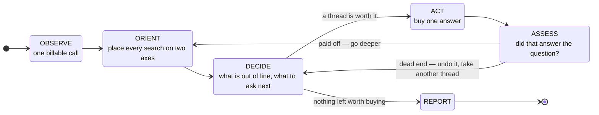
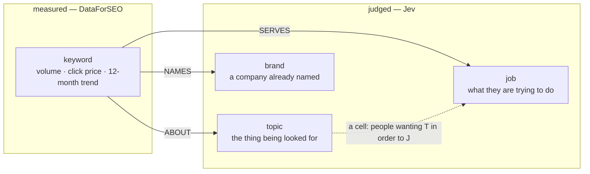

# keyword-insights

One keyword in. A markdown report of data-backed findings out.

```bash
python3 .claude/skills/keyword-insights/scripts/loop.py run "crm software" \
  --for "a founder deciding whether to build here" --effort normal
```

That is the whole interface. The script measures, judges, chases, writes the
report, and prints what it cost. **No language model is involved in
producing the findings** — sentences are assembled by code from measured
numbers, and every judgment about them is made by TypeSafe's Jev, a typed
model that answers one question at a time and returns a calibrated
probability rather than prose.

That constraint is the point. A skill that needs an LLM to interpret its own
output cannot be re-run and get the same answer, cannot be evaluated, and
quietly launders the model's priors into what looks like a finding about
data. This one returns the same report for the same keyword, which is why
the numbers in `evals/LEDGER.md` mean anything.

## What it is for

The question behind every run is **"is this insight actually valuable to the
person asking?"** — so who is asking is an input, not a footnote:

```bash
--for "a founder deciding whether to build here"
--for "a marketer with £5k to spend next quarter"
--for "an investor checking whether this category is growing"
```

The same data judged for a different reader keeps a different set of
findings. A seasonality finding matters enormously to someone buying ads in
October and not at all to someone choosing what to build.

## The loop

It is shaped like a person working, not like a pipeline. A person does not
run three fixed steps; they notice something odd, chase it, hit a dead end,
back up, and take a different branch.



**Backtracking is literal.** When a probe's results do not bear on the
question it was bought to answer, the loop discards the keywords it brought
in and drops every other question of the same kind. Keeping a tangent would
crowd out the next batch of judging and drag the market's medians toward a
market nobody asked about; trying the next brand name after the first taught
you nothing is not persistence.

Dead ends go in the report. A branch that was chased and went nowhere is a
real result and an expensive one.

## Effort

One dial, 1 to 5, or the names `glance` `quick` `normal` `deep`
`exhaustive`. It moves five things that have to move together — how many
ranking businesses get harvested, how many probes are allowed, how much of
the corpus is placed on the two axes, how many claims are tested, and the
ceiling on spend.

```bash
--effort 1        # or glance
--effort normal   # the default, same as 3
--effort 5        # or exhaustive
```

`--iterations`, `--sites`, `--judge-cap`, `--max-claims`, `--min-bits` and
`--max-spend` still exist and still win where they are given. Effort only
fills in what the caller left alone.

**The dial is really the floor on what an answer is worth buying.** A probe
costs $0.09 and buys some expected reduction in uncertainty about what the
reader came for, so the only question that matters is *how small an answer
will you pay $0.09 for* — 0.05 of a bit at effort 1, 0.002 at effort 5.
Stating it that way retires the one arbitrary constant this loop had:
nobody has to defend 0.01 any more, because it became the caller's choice,
in units they can argue with.

**It is a ceiling, not a target.** Effort 5 does not mean eight probes; it
means up to eight, and the loop still stops the moment nothing on the table
clears the floor. In the measured ladder below, effort 5 sometimes buys
*fewer* probes than effort 3, because four harvests had already answered
what two left open. A market with nothing in it costs the same at every
setting.

### What it actually buys

Three runs at each level on the same seed, Jev cache off so every run asks
fresh:

| effort | sites | probes | keywords | coverage | findings | data | jev |
|---|---:|---:|---:|---:|---:|---:|---:|
| 1 glance | 1 | 0 | ~95 | 23–29% | 4, 4, 4 | $0.24 | $0.005 |
| 3 normal | 2 | 1–2 | 434–735 | 42–57% | 3, 4, 6 | $0.48 | $0.025 |
| 5 exhaustive | 4 | 2–3 | 731–1,027 | 44–64% | 4, 5, 5 | $0.68 | $0.035 |

Read the two right-hand columns against each other. **Effort buys coverage,
not findings.** The spread in findings *within* one effort level (3 to 6 at
normal) is as wide as the spread across the whole dial, so two findings
either way is noise and nobody should pick a setting expecting more of
them. What moves is the share of the market a finding is about: a
conclusion drawn over 57% of the searching is worth more than the same
sentence drawn over 25% of it, and that is what the extra $0.44 buys.

Findings are a count of things that survived testing, and survival is a
judgment made one claim at a time — near the 0.5 line it goes either way
between runs. Coverage is arithmetic over the whole corpus, so it is
stable. That is why the ladder is read on coverage.

## Who decides what

> **Code counts. Jev concludes.**

| | does | never does |
|---|---|---|
| **Code** | sums, medians, ratios, slopes, sorting, batching, budget, assembling claim sentences from templates | decides whether a number is high, interesting, or worth reporting |
| **Jev** | what a phrase means, what a searcher wants, which of two accounts the data supports, what is out of line, what to chase, when to stop, what matters to the reader | arithmetic, counting, comparing magnitudes, generating text |

Jev-1.13 cannot count and cannot do arithmetic, so asking it to compare
numbers gets confident nonsense. It reads short phrases against explicit
criteria extremely well, which is exactly the work code cannot do. The line
between them is not a style preference — it is drawn where each one breaks.

Every constant that decides something about the world was removed. What is
left in code are two structural facts (a phrase appearing in one keyword
describes that keyword rather than a group; a Choice stops discriminating
past about eight options) and one probability floor of 0.5, which is not a
tuned number but the point at which the model says yes rather than no.

See `references/jev-contract.md` before changing any question.

## The seed is a business, not a word

The opening move is not to expand the keyword. It is to search it, work out
which of the results is a company actually selling into this market, and
harvest **that company's** keyword footprint.

The reason is a measurement, on one market, at the same $0.09:

| | keywords | searches a month |
|---|---:|---:|
| `expand "epcr"` | 31 | 2,100 |
| **`for-site eso.com`** | **619** | **367,940** |

`for-keywords` expands off the breadth of a *string*, so a niche phrase
returns almost nothing — `investtech` gave 18 rows, `ambulance software` 25.
`for-site` expands off what a live business is *about*, and a business that
has paid to rank is evidence somebody is selling here. **Invented keywords
are hypotheses; harvested ones are observed commercial vocabulary.** It also
reaches words no expansion could: harvesting a CAD-to-BIM firm turned up
`bim service providers` at $219 a click and `revit outsourcing` at $174 —
the most valuable searches in that market, and nobody would have thought
to seed them.

**A business is wider than its market, so the harvest is gated.** Harvesting
Radar Healthcare for `ambulance software` returned 503,680 searches a month
of which 680 were ambulances; the rest was the whole of UK healthcare. Left
in, that does not merely add noise — topics are mined by volume, so the
incumbent's other business outvotes the market's own vocabulary and the
report ends up about the wrong thing.

Every search that comes in — from a harvest or a probe — is asked one
thing: **is it about what this market deals in, whatever the person wants
to do with it?** Not whether a seller would care about it, which admits
the customers' whole world (`structural engineering` and `architecture
firms` into `cad to bim`); and not whether the searcher is buying, which
throws out everyone learning or doing it themselves (`sourdough starter
recipe` out of sourdough). What someone wants is the job axis's question.
Across seven labelled markets the first wording dropped 14% of plainly
foreign terms, the second 94% while losing 14% of the real market, and
this one drops 92% while keeping 96% (ledger it-21).

**A common word with a second meaning gets through that question** — read
against a CAD-to-BIM market, `drawings` means CAD drawings. It was admitted
at 1,830,000 searches a month, 64% of the corpus on its own. So any search
larger than the rest of the market combined is asked once more, with that
fact stated in words, whether most people typing it could be here. The
rule has no constant in it and, across nine markets already run, fired on
exactly one search.

**Finding that nobody selling ranks is not a failure.** It is the most
decisive thing the loop can learn, and it falls through to Google's idea
list saying so.

```bash
--sites 2        # how many ranking businesses to harvest (default 2)
--no-harvest     # seed from the keyword alone, which on a niche seed
                 # returns very little
```

## The answer, not just the facts

A report that lists facts leaves the reader to do the reasoning. This one
opens with the conclusion:

```
| Buying customers here with search ads can pay for itself | 69% | 54% | fell |

what moved it:
  -0.12 against — 16% of the searching whose intent is clear is people
                  solving this without buying anything
  -0.08 against — Google rates competition at 36 out of 100
  +0.06 toward  — the last twelve months ran at 1.12x the twelve before
```

That comes from a small Bayes network over the things a market can be — will
people here pay, do the words reveal what anyone wants, have buyers settled
on suppliers, is there a free route, is it growing. **Jev supplies every
probability table in one request**; the measurements enter as evidence; code
does exact inference.

The idea is Frank Dellaert's: a Choice over outcomes is exactly the shape of
a conditional probability table row, so a language model can supply a whole
network zero-shot, and a conventional engine then answers an unbounded
family of queries **without another model call**. It is this skill's own
contract — code counts, Jev concludes — at the level of a joint distribution
rather than thirteen separate judgments.

Three things fall out of it that flat judging could not give:

- **Coherence.** Findings come from one distribution, so they cannot
  contradict each other.
- **Free re-inference.** After the first request the tables are cached, so
  updating the whole picture with new evidence costs nothing. The loop
  re-infers every iteration for about a hundredth of a cent.
- **A principled next probe.** The DECIDE step computes **expected entropy
  reduction** — how many bits answering a question would remove from what
  the reader came to find out — instead of asking a model to rate it.

**The structure was audited, not assumed.** Asked which property each
measurement is evidence about, Jev agreed with six of eight hand-drawn edges
and corrected two, both correctly. That cost $0.000078. Asked which
properties bear on each conclusion, it gave two of them identical answers —
which is the model saying the data cannot tell those two apart, and it was
right, so one was dropped. See `evals/LEDGER.md`, it-11.

**Calibration is unverified**, and the report says so. This network is not a
published benchmark, so there is no established answer to check against.
Direction and size of movement are the signal; the absolute figure is an
estimate.

## What it would cost to act on it

Every run closes with one more call: Google's own forecast for the searches
here worth bidding on — the ones where someone is buying, comparing or
looking for a supplier nearby, not reading a definition or hunting a job.

```bash
loop.py run "garden rooms" --location "United Kingdom" --budget 4000 --currency "£"
```

> **£4,000 a month buys about 1,389 of the 3,069 clicks available** — 45% of
> what this market has to sell at this bid.
>
> You would bid £4.78 and pay £2.88 — 40% under your maximum.

Search volume says how many people look. This says how many of them can be
bought and what they cost, which is a different number and usually a much
smaller one: a market with 165,000 searches a month can have 232 clicks
available at a bid worth making. Knowing that before committing a budget is
most of the value of the exercise, and it is the difference between a report
that describes a market and one that answers what to do about it.

The bid is derived, not invented — the median top-of-page bid already
measured on the very keywords being forecast. `--budget` adds what yours
buys, including the case that matters most: when the market has less to sell
than you were going to spend. `--no-forecast` skips the call.

## The graph

Two axes and one set of names. Every finding is a statement about this
structure.



The **job** taxonomy is fixed and universal — `buy`, `compare`, `learn`,
`self_serve`, `fix`, `local`, `career`, `brand_desk`. Eight things a person
can be doing at a search box, in any market. A taxonomy mined per run would
be easy to vary: you could always find one that flattered the data. This one
has to survive every market it meets.

**Topics** are mined from the corpus as n-grams and confirmed by Jev, minus
two kinds that are not topics: a brand (a cluster anchored on "asana" makes
"this cluster names a company" true by construction) and a fragment
("management" is "task management" with the meaning removed).

See `references/graph.md` for the node and edge schema and what each finding
family reads off it, and `references/flow.md` for the whole machine in three
diagrams — end to end, the control loop, and the network.

## Findings

Every statement the shape of the data permits is built and tested —
including pairs that contradict each other, so that the testing decides
which is true rather than the generator. Each one is built twice: `text`
carries the measurements and is what the reader sees; `assertion` is the
same reading with every digit removed, and that is what gets tested. A
sentence containing "165,000/mo at $49.28" passes any test for specificity
on the strength of its digits alone.

Four tests, each asked separately because a bundled rubric returns a
confident-looking number with no confidence behind it:

| test | what it asks | kills |
|---|---|---|
| **fair reading** | Do the measurements say what this says they say? | the numbers were right, the reading was not |
| **account** | Which of these two accounts of the market does the data support? | claims whose opposite fits the data better |
| **swap** | With its subject replaced by an unrelated one, does this still read as fair? | statements that were never about this market |
| **guessable** | Could someone say this knowing only the market's name? | findings the data did not pay for |

Surprise and stakes are also measured, but only order the results. Surprise
is evidence about how much a finding matters, not whether it is true —
gating on it threw away eight true statements in a row.

## Cost

Every DataForSEO call bills the same whether it carries one keyword or a
thousand, so a probe that tests 26 guesses has wasted nine tenths of what it
paid for. Probes are filled to the brim.

| | typical run |
|---|---|
| DataForSEO | one harvest per site plus up to `--iterations` probes, ~$0.09 each, and one closing forecast |
| Jev | $0.005–0.04 — input tokens only, output is free |
| default `--effort normal` | **~$0.46 and about 25 seconds** |

Judgment is 5% of the bill, which decides an argument that comes up
repeatedly: given a harvest already bought for $0.09, it is never worth
saving a cent of Jev by leaving part of it unread. See **Effort** above,
and `--relevance-cap`.

```bash
loop.py run "crm software" --dry-run      # what it would cost, spends nothing
--effort glance                           # or 1..5, see above
--max-spend 0.50                          # checked before each call, not after
--offline                                 # replay cached responses only
```

Costs reported are the `cost` field each response returned — the amount the
vendor actually billed. Nothing here estimates its own spend.

Every call asks for **four years of monthly history**, which DataForSEO
returns at the same price as twelve months. That is what makes a real
year-on-year figure possible: twelve months cannot separate a trend from a
season, and dividing one part of a single year by another produces a
seasonal artefact wearing a trend's clothes. See `references/graph.md`.

## Running it

1. **Pick the seed deliberately.** A head term ("crm software") expands into
   thousands of ideas; a long-tail seed ("ai sales coach") sometimes returns
   only itself, because Google genuinely has nothing more to give for it.
   That is a property of the data, not a failure to retry around.
2. **Set the location.** Defaults are US/English. The wrong geo returns
   confidently wrong numbers — "coffee shop" is ~2.7M/mo in the US and
   ~1.3k in Oslo.
3. **Say who is asking**, in a sentence about the decision they face.
4. **Pick an effort.** `normal` for a market you are weighing up;
   `glance` when you only want to know whether there is anything here at
   all; `exhaustive` when the answer is going to be acted on and the
   difference between 25% and 57% of the searching matters. `--dry-run`
   prints what any setting would cost before spending a cent.
5. **Read the report, including the rejections.** "Checked, and it did not
   hold" tells the reader what was looked for and not found, which is often
   more useful than what was.

Credentials come from the environment and are never printed or written to
the report: `DATA_FOR_SEO_LOGIN` / `DATA_FOR_SEO_PASSWORD`, and
`TYPESAFE_API_KEY` (or `TYPESAFEAI_API_KEY`), falling back to a `.env` in
the working directory.

## Changing it

Run the evals first, change one thing, run them again, and write down both
numbers — including when they get worse.

```bash
python3 .claude/skills/keyword-insights/evals/run_evals.py --save
```

Four cases, replayed from frozen responses, so the data cost is **$0.00**.
One of them is a market that does not exist: a method that cannot return
"there is nothing here" will return something for anything, and that case is
the only one that catches it.

`evals/LEDGER.md` records every change and what it did to the measurements.
It is worth reading before editing a rubric — most of the obvious
improvements have already been tried, and several of them made things worse.

## Files

| | |
|---|---|
| `scripts/loop.py` | the OODA driver and the CLI |
| `scripts/seo.py` | DataForSEO, cached and budgeted, with real billed costs |
| `scripts/serp.py` | who ranks for a search — the bridge from a word to a business |
| `scripts/kgraph.py` | the graph and all the arithmetic. No judgment |
| `scripts/judge.py` | every Jev question in the skill |
| `scripts/insights.py` | claim templates and the follow-up table |
| `scripts/market_net.py` | the Bayes net: variables, structure, Jev-supplied tables, exact inference |
| `scripts/report.py` | the markdown |
| `scripts/jev.py` | typed Jev client, stdlib only |
| `scripts/selftest.py` | offline and live checks |
| `references/flow.md` | the whole data and algorithm flow, in three diagrams |
| `references/jev-contract.md` | how to write a question Jev answers well |
| `references/graph.md` | node and edge schema, finding families |
| `evals/` | cases, harness, and the hill-climbing ledger |
