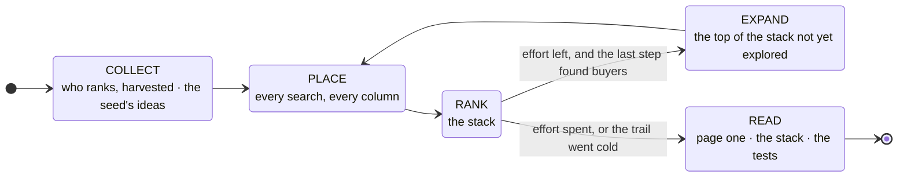
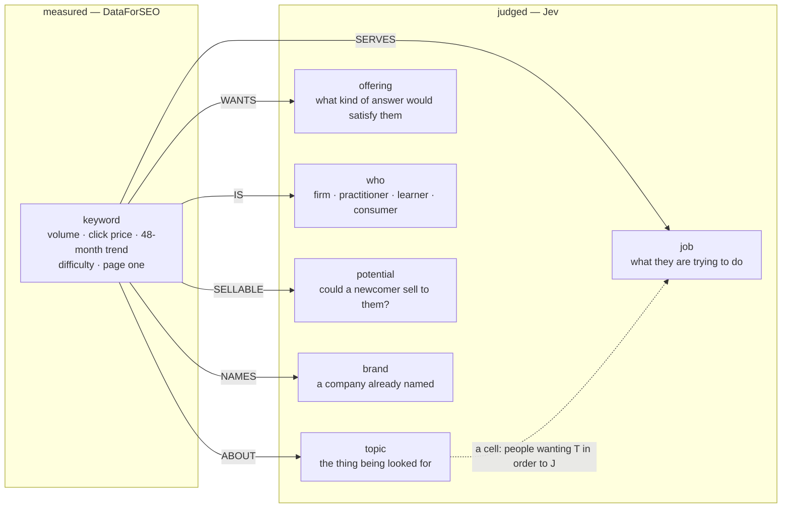

# keyword-insights

A seed and an effort in. Insights out — most valuable first — with every
number underneath them attached as files.

```bash
python3 .claude/skills/keyword-insights/scripts/loop.py run "cad to bim" --effort 5
```

That is the whole interface. The script collects, places, ranks and goes
deeper, and writes two things beside each other:

```
insights-cad-to-bim.md          the insights, ranked by value
insights-cad-to-bim-data/       keywords.csv       offerings.csv  topics.csv
                                opportunities.csv  page_one.csv   share_of_voice.csv
                                tested.csv         series.csv     trail.csv
                                network.json       forecast.json  run.json
```

**No language model is involved at any step.** Data comes from DataForSEO;
every judgment — whether a search belongs to the market, what it is about,
what the person wants, what kind of answer would satisfy them, who they
are, whether a newcomer could sell to them, whether a statement holds, what
it is worth to the reader — is made by TypeSafe's Jev, a typed model that answers one
question at a time and returns a calibrated probability rather than prose;
every sentence is assembled by code from measured numbers.

That constraint is the point. A skill that needs an LLM to interpret its own
output cannot be re-run and get the same answer, cannot be evaluated, and
quietly launders the model's priors into what looks like a finding about
data. This one returns the same insights for the same keyword, which is why
the numbers in `evals/LEDGER.md` mean anything.

**So the deliverable is the report and its data folder, as written.** When
running this for someone, hand over the insights file and the data folder;
quote its headlines if asked for a summary. Do not add insights of your own
on top — "the money is in services, not software" was once found that way,
by hand, after a run, and the skill was changed so that it finds such things
itself (ledger it-22). An insight the report does not contain is one the
data did not support through the tests, or one the skill cannot yet see; the
second is a change to the skill, not a paragraph in a reply.

## What it is for

The question behind every run is **"is this insight actually valuable to the
person asking?"** — so who is asking is an input, not a footnote:

```bash
--for "a founder deciding whether to build here"
--for "a marketer with £5k to spend next quarter"
--for "an investor checking whether this category is growing"
```

The same data judged for a different reader keeps a different set of
findings. A seasonality finding matters enormously to someone buying ads in
October and not at all to someone choosing what to build.

## The graph search, and the stack

A market is a graph — searches, the businesses ranking for them, and the
searches around those — and a practitioner works it as a sheet: every
keyword, every column, sorted by what it is worth, then dig where the top
rows are. So does this.



**Every search gets every column.** Measured by DataForSEO — searches a
month, click price, bids, difficulty, four years of history. Judged by Jev —
whether it belongs to the market (read against its first page, for the
searches that carry the market), what it is about, what the person is trying
to do, what kind of answer they want, who they are, and **business
potential**: could a newcomer here sell to them? That is the column Ahrefs
asks its users to fill in by hand, one keyword at a time; a search is
*sellable* when more than half of Jev's weight says yes. Nothing is capped:
judging a search costs about a thousandth of a cent, so the stack is the
whole market, not its head.

**The stack rank.** Three tiers, the funnel Grow and Convert measured
(bottom-of-funnel visitors became leads at 4.78%, top-of-funnel at 0.19%):
people a newcomer could sell to who are buying, comparing or looking for a
supplier; then the rest a newcomer could sell to; then everyone else.
Within a tier, the money in the clicks — searches times click price, what
Ahrefs and Semrush call traffic value. Keys, not weights: the tiers are
Jev's readings and the order within them is arithmetic, and nothing is
traded against anything else. `keywords.csv` *is* the stack — every search,
every column, ranked.

**The search goes best-first.** Each unit of effort is one expansion:
Google's own ideas around the twenty searches at the top of the stack not
yet explored, one $0.09 call; what comes back is vetted, grounded, placed
and ranked again, so the next step starts from the new top. It stops when
effort is spent, or when the best of what is left brings back nothing a
newcomer could sell to. It replaced a loop that chased questions raised by
findings and priced template guesses to answer them — `top modelling` was
one of those guesses (it-23). Expanding real searches brings back real
searches, and "where next?" became the obvious answer: wherever the value
is. Each step, its seeds and what it found are in `trail.csv`, and each
search carries the depth at which the search found it.

## Effort

One dial, 1 to 5, or the names `glance` `quick` `normal` `deep`
`exhaustive`. It is how far the graph search goes: how many ranking
businesses are harvested at the start (1 to 4), how many times the top of
the stack is expanded (1 to 8), how many first pages are read — the
market's largest searches held to what Google shows, and the top of the
stack read for where someone could win — how many statements are tested,
and the ceiling on spend ($0.40 at 1 to $2.20 at 5).

```bash
--effort 1        # or glance
--effort normal   # the default, same as 3
--effort 5        # or exhaustive
```

`--iterations`, `--sites`, `--judge-cap`, `--max-claims` and
`--max-spend` still exist and still win where they are given. Effort only
fills in what the caller left alone.

**It is a ceiling, not a target.** Effort 5 means up to eight expansions;
the search stops earlier when the top of the stack goes cold. A market with
nothing in it costs the same at every setting.

## Who decides what

> **Code counts. Jev concludes.**

| | does | never does |
|---|---|---|
| **Code** | sums, medians, ratios, slopes, sorting the stack, choosing what to expand next (the top of the stack), batching, budget, assembling claim sentences from templates | decides whether a number is high, interesting, or worth reporting |
| **Jev** | whether a search belongs, what it is about, what a searcher wants and who they are, whether a newcomer could sell to them, what a page on Google is, which of two accounts the data supports, what matters to the reader | arithmetic, counting, comparing magnitudes, generating text |

Jev-1.13 cannot count and cannot do arithmetic, so asking it to compare
numbers gets confident nonsense. It reads short phrases against explicit
criteria extremely well, which is exactly the work code cannot do. The line
between them is not a style preference — it is drawn where each one breaks.

Every constant that decides something about the world was removed. What is
left in code are two structural facts (a phrase appearing in one keyword
describes that keyword rather than a group; a Choice stops discriminating
past about eight options) and one probability floor of 0.5, which is not a
tuned number but the point at which the model says yes rather than no.

See `references/jev-contract.md` before changing any question.

## The seed is a business, not a word

The opening move is not to expand the keyword. It is to search it, work out
which of the results is a company actually selling into this market, and
harvest **that company's** keyword footprint.

The reason is a measurement, on one market, at the same $0.09:

| | keywords | searches a month |
|---|---:|---:|
| `expand "epcr"` | 31 | 2,100 |
| **`for-site eso.com`** | **619** | **367,940** |

`for-keywords` expands off the breadth of a *string*, so a niche phrase
returns almost nothing — `investtech` gave 18 rows, `ambulance software` 25.
`for-site` expands off what a live business is *about*, and a business that
has paid to rank is evidence somebody is selling here. **Invented keywords
are hypotheses; harvested ones are observed commercial vocabulary.** It also
reaches words no expansion could: harvesting a CAD-to-BIM firm turned up
`bim service providers` at $219 a click and `revit outsourcing` at $174 —
the most valuable searches in that market, and nobody would have thought
to seed them.

**A business is wider than its market, so the harvest is gated.** Harvesting
Radar Healthcare for `ambulance software` returned 503,680 searches a month
of which 680 were ambulances; the rest was the whole of UK healthcare. Left
in, that does not merely add noise — topics are mined by volume, so the
incumbent's other business outvotes the market's own vocabulary and the
report ends up about the wrong thing.

Every search that comes in — from a harvest or an expansion — is asked one
thing: **is it about what this market deals in, whatever the person wants
to do with it?** Not whether a seller would care about it, which admits
the customers' whole world (`structural engineering` and `architecture
firms` into `cad to bim`); and not whether the searcher is buying, which
throws out everyone learning or doing it themselves (`sourdough starter
recipe` out of sourdough). What someone wants is the job axis's question.
Across seven labelled markets the first wording dropped 14% of plainly
foreign terms, the second 94% while losing 14% of the real market, and
this one drops 92% while keeping 96% (ledger it-21).

**A common word with a second meaning gets through that question** — read
against a CAD-to-BIM market, `drawings` means CAD drawings. It was admitted
at 1,830,000 searches a month, 64% of the corpus on its own. So any search
larger than the rest of the market combined is asked once more, with that
fact stated in words, whether most people typing it could be here. The
rule has no constant in it and, across nine markets already run, fired on
exactly one search. So is any search the loop made up or Google suggested
that outsizes everything the market's own businesses rank for — `how to
drawings`, 301,000 a month, inherited from "how to draw" when a probe
combined "how to" with the topic "drawings" (it-22).

**Then every large search is checked against what Google shows for it.**
The two rules above compare sizes, and size stopped being enough: on `cad
to bim` a harvested `modelling 3d` at 135,000 a month raised the ceiling the
second rule compares against, so a probe's `top modelling` (8,100 a month —
modelling agencies), `modelling jobs` and `what is modelling` passed beneath
it, and became the report's first three insights. Every practitioner checks
intent the same way — search it and look — because page one is ranked on
what the people typing a search go on to click. So the searches that carry
the market's volume (`ground`: 10 to 50 by effort), and the buying searches
worth most (`pages`: 10 to 60), are each read against their first page from
DataForSEO's SERP API, and Jev answers the relevance question again with
those pages in front of it — same criteria, so "in this market" keeps one
definition, better evidence. Dropping one lets the next largest into the
head, so the head is always read. $0.002 a page; `--no-ground` skips it
(it-23).

**Finding that nobody selling ranks is not a failure.** It is the most
decisive thing the loop can learn, and it falls through to Google's idea
list saying so.

```bash
--sites 2        # how many ranking businesses to harvest (default 2)
--no-harvest     # seed from the keyword alone, which on a niche seed
                 # returns very little
```

## What comes out

**The top of the stack, under the title.** Ten rows of buyers a newcomer
could sell to, most valuable first, each with its searches a month, what
its clicks are worth, its click price, difficulty, year on year, what the
person is trying to do, what kind of answer they want and who they are —
and how many of those buyers carry half of all their money. Then five rows
of the next tier, people a newcomer could sell to who are not buying yet,
and whether their money outweighs the buyers': on `cad to bim` two searches
of people learning what an as-built is are worth more than every buyer in
the market put together.

**The insights, most valuable first.** Every statement the data could
support is generated and tested (see **Findings**); the survivors are
ranked by Jev's answer to one question — *which of these would change what
the reader does the most?* — asked in groups of at most eight, because a
Choice stops discriminating past that. Each insight is its point in a few
words, the sentence with the numbers, a table where it compares groups, the
searches it rests on, and a line saying what it is worth to the reader and
how it held up:

```
## 3. The money is in services, not information

The money is in services, not information: people looking for services are
2% of the searching but 5% of the ad spend, at $27.99 a click — 2.6x the
$10.65 paid for people looking for information, who are 76% of the searching.

| wants       | searches/mo | of the searching | of the ad spend | click price |
| information |     360,750 |              76% |             75% |      $10.65 |
| software    |     102,350 |              22% |             20% |       $9.84 |
| services    |       9,140 |               2% |              5% |      $27.99 |

Behind it: `bim service providers (50/mo, $219.43)` · `revit outsourcing (20/mo, $174.49)`
Worth to the reader: A choice — it tells them which of two paths to take
```

**When nothing survives, the report says so and stops.** No padding with
the statements that failed; they are in `tested.csv`, each with the reason.
A market with nothing in it is a result.

**Everything else is data, in files beside the report:**

| file | what is in it |
|---|---|
| `keywords.csv` | the stack rank — every search, most worth winning first: its tier, whether a newcomer could sell to it and how surely, volume, click price, what it is worth, difficulty, year on year, topic, what the person is trying to do, what kind of answer, who they are, companies named, where it came from and at what depth of the graph search |
| `offerings.csv` | each kind of answer — a service, software, a product, information — and what it is worth |
| `topics.csv` | each thing people search about, and what it is worth |
| `tested.csv` | every statement generated, each test's score, its rank or the reason it fell |
| `series.csv` | searches a month for every keyword, month by month, four years |
| `trail.csv` | every step of the graph search — the searches expanded, at what depth, and what came back |
| `network.json` | the market network's conclusions before and after measuring, and what moved them |
| `forecast.json` | Google's forecast for the searches worth bidding on |
| `run.json` | the run: seed, effort, reader, what every stage cost |
| `opportunities.csv` | each group of buying searches one page could answer — what it is worth, its difficulty, what holds its first page, and the money sitting on pages not built for it |
| `page_one.csv` | every first page read — each result, what kind of page it is, and whether the search stayed in the market |
| `share_of_voice.csv` | which sites take the clicks the buying searches send |

### The market network

A small Bayes network of what a market can be — will people pay, do the words
reveal what anyone wants, have buyers settled on suppliers, is there a free
route, is it growing. **Jev supplies every probability table in one
request**; measurements enter as evidence; code does exact inference. The
idea is Frank Dellaert's: a Choice over outcomes is exactly the shape of a
conditional probability table row, so a model can supply a whole network
zero-shot, and a conventional engine answers an unbounded family of
queries without another model call. The structure was audited, not assumed
(ledger it-11).

Its conclusions used to open the report, and its expected entropy
reduction used to choose the probes. They are in `network.json` now:
**its calibration is unverified**, and a probability the reader cannot check
is not an insight; the graph search goes where the value is instead (it-24),
and the file says what the network concluded and what moved it.

## Where to win

A critique of the report this skill produced for `cad to bim` found every
insight true and almost none useful: which topic names brands, how intent
is mixed, where a click is dearer — statistics about a corpus. The people
who are good at this start from **where someone could win**, and each has a
heuristic for it. Each became a family, fed by page one, Labs difficulty
and share of voice from DataForSEO, and tested like every other finding:

| family | framework | reads | example |
|---|---|---|---|
| `start_here` | [Pain Point SEO](https://www.growandconvert.com/seo/pain-point-seo/) (Grow and Convert), [Ahrefs' difficulty](https://ahrefs.com/blog/ahrefs-seo-metrics/), Moore's beachhead | buying searches grouped by **three shared top-ten results** — Google's own judgment that one page can answer them ([SE Ranking's grouping level](https://seranking.com/blog/keyword-clustering/)); code keeps the groups nothing beats on buyer money naming no company, difficulty and first-page weakness at once, and Jev picks among them, each described in words | *Start with "bim modeling services": $50,713 a month of buyer clicks, difficulty 9, page one seven specialist firms* |
| `open_door` | weak-spot SERP analysis ([Detailed](https://detailed.com/forum-serps/), [Semrush](https://www.semrush.com/blog/finding-serp-weak-spots/)) | the group with the most buyer money on pages not built for it — forum, social, off-target — weighted by position | *The door left open is "bim modeling software": reddit.com at 1* |
| `who_answers` | the kind of page ahead on buyers' first pages, and what practitioners do about it — [Barnacle SEO](https://barnacleseo.com/) (Will Scott) when directories hold it, head-on when specialists do, the weak-spot move when forums do | where buyers' page-one clicks go, by kind of page, weighted by position and by what each group is worth; named only when one kind is ahead as printed | *Buyers here are answered first by directories and review sites* |
| `customer_cost` | [channel–model fit](https://brianbalfour.com/essays/channel-model-fit-for-user-acquisition) (Brian Balfour) | average buyer click, by what the buyer wants, over the [4.78% bottom-of-funnel lead rate](https://www.growandconvert.com/conversion-rate-optimization/average-seo-conversion-rate/) Grow and Convert measured | *A lead for services costs $749 through search; for software, $103* |
| `who_owns` / `who_owns_not` | share of voice | Labs' estimate of the clicks each site takes across the buying searches; forums and articles counted in the whole, but not as who a newcomer competes with | *No business owns buyer search here* |
| `share_of_search` | [share of search](https://ipa.co.uk/effworks/effworksglobal-2020/share-of-search-as-a-predictive-measure) (Les Binet, IPA) | each named brand's share of the branded searching, a year apart | *"revit" is taking share of search from "autocad"* |
| `switching` | [the four forces](https://jobstobedone.org/the-four-forces/) (Bob Moesta) | "alternatives to X", "X vs", bought for the brands found | *People are looking for a way out of "revit"* |
| `pattern` | [product-led SEO](https://www.lennysnewsletter.com/p/rethinking-seo-in-the-age-of-ai-eli-schwartz) (Eli Schwartz) | one-slot keyword skeletons with three or more fillers, checked by Jev to be one kind of thing | *Build one page for every "… to revit"* |
| `new_demand` | why now | searches with no month above 10 three years ago, now at least as large as the market's typical search | *New since 2023: "…"* |

The click split uses [First Page Sage's 2026 CTR by position](https://firstpagesage.com/reports/google-click-through-rates-ctrs-by-ranking-position/)
as **relative** weights only — studies disagree about the level (27.6% at
position one in [Backlinko's](https://backlinko.com/google-ctr-stats), 7.1%
in First Page Sage's after AI overviews) far more than about the shape.

**No weights are chosen anywhere in "where to start".** Code removes every
group another beats on all three counts at once; what is left is a set of
genuine trade-offs, and choosing among those is judgment. Two rules came
from getting it wrong on `cad to bim`: ranked by forum-held clicks alone,
the first pick was `revit price` — people pricing Autodesk's own product,
whom no other page can serve — so **only searches naming no company
count**; and it could never offer the services groups, which hold the
market's buyer money behind first pages of small specialist firms at
difficulty under 25, so **difficulty is one of the counts**. Each finding
says which framework found it, beneath it in the report.

## Where the buyer money is

The second line under the title is a measurement too: the group of buying
searches with the most money in it that a newcomer could answer — searches
naming no company, grouped by page one — with its difficulty, its year on
year and what holds its first page:

> Where the buyer money is: **"bim modeling services"** carries the most a
> newcomer could answer — $50,713 a month of clicks across 6 searches Google
> answers with the same pages, difficulty 9 of 100, 0.64x the year before;
> page one is 7 specialist firms and 1 directory or review site.

Whether that is the place to *start* is a judgment, tested as the
`start_here` finding, and on `cad to bim` it is a genuinely mixed case —
the most money, behind specialists, falling by a third — that survives in
some runs and not others. The measurement stands either way.

## What paid search can buy

Every run closes with one more call: Google's own forecast for the searches
here worth bidding on — the ones where someone is buying, comparing or
looking for a supplier nearby. It is the line under the report's title:

> All of paid search here: **$199 a month** buys every click worth having —
> 24 clicks at $8.41, from the 77 searches worth bidding on.

Search volume says how many people look; this says how many of them can be
bought and what they cost, which is usually a much smaller number. With
`--budget` the line sets it against yours — *"Your $10,000 is 50.3x what that
can absorb"* — which is the case that matters most. The bid is the median
top-of-page bid already measured on those keywords; `--no-forecast` skips
the call.

It is a measurement, so it is reported as one. It was briefly built as two
findings for the tests to choose between — "a small channel", "a large one"
— and the judgment model called $273 a month the large one: with no
reference to hold it against, small or large is a question about magnitude,
which is exactly what Jev cannot answer (it-22). The only comparison made is
against a number the reader supplied.

## The graph

Every search, and the columns Jev fills for it. Every finding is a
statement about this structure, and the stack is this structure sorted.



**Who** is fixed and universal like the others — a firm buying for work,
someone doing the work themselves, someone learning it, someone buying for
themselves — and held out when a search does not say. **Potential** is
Ahrefs' business potential, asked for a newcomer: asked for any business
selling here, people pricing a Revit licence ranked among the searches most
worth selling to, which is true for Autodesk and no use to anyone entering
(it-24).

The **job** taxonomy is fixed and universal — `buy`, `compare`, `learn`,
`self_serve`, `fix`, `local`, `career`, `brand_desk`. Eight things a person
can be doing at a search box, in any market. A taxonomy mined per run would
be easy to vary: you could always find one that flattered the data. This one
has to survive every market it meets.

The **offering** taxonomy is fixed and universal in the same way —
`service` (someone to do it for them), `software` (a tool to use
themselves), `product` (a physical thing), `information` (knowledge). It is
the axis that separates two people doing the same job: `bim modeling
services` and `bim software` are both shopping, one for a firm and one for a
tool, and on `cad to bim` a click on the first costs about three times the
second. Without it the skill could not see the most useful contrast in that
market, and it was found by hand (it-22). A search that does not say what
kind of answer it wants is held out, as with jobs, rather than forced.

**Topics** are mined from the corpus as n-grams and confirmed by Jev, minus
two kinds that are not topics: a brand (a cluster anchored on "asana" makes
"this cluster names a company" true by construction) and a fragment
("management" is "task management" with the meaning removed).

See `references/graph.md` for the node and edge schema and what each finding
family reads off it, and `references/flow.md` for the whole machine in three
diagrams — end to end, the control loop, and the network.

## Findings

Every statement the shape of the data permits is built and tested —
including pairs that contradict each other, so that the testing decides
which is true rather than the generator. Each one is built twice: `text`
carries the measurements and is what the reader sees; `assertion` is the
same reading with every digit removed, and that is what gets tested. A
sentence containing "165,000/mo at $49.28" passes any test for specificity
on the strength of its digits alone.

Four tests, each asked separately because a bundled rubric returns a
confident-looking number with no confidence behind it:

| test | what it asks | kills |
|---|---|---|
| **fair reading** | Do the measurements say what this says they say? | the numbers were right, the reading was not |
| **account** | Which of these two accounts of the market does the data support? | claims whose opposite fits the data better |
| **swap** | With its subject replaced by an unrelated one, does this still read as fair? | statements that were never about this market |
| **guessable** | Could someone say this knowing only the market's name? | findings the data did not pay for |

**A premise has to hold as printed.** Code checks each sentence's own
numbers before it is built — a direction is only "growing" or "shrinking"
when the year's twelve months stand apart from the twelve before (a
Mann-Whitney test at the conventional 5%), "settled" means most of the
shoppers name a company, "open ground" means at least the market's own
share is buying, and a share can never pass 100%. Each of those rules came
from a report that printed a sentence its numbers contradicted (it-21,
it-23).

Surprise is also measured, but only orders the results: it is evidence
about how much a finding matters, not whether it is true — gating on it
threw away eight true statements in a row.

**And a value floor.** Asked what a statement does for the reader —
nothing, colour, a choice between two paths, or a reversal of the plan they
came with — a finding is kept only if Jev puts **more than half** its
weight on the two that change a decision, the same majority the account
test is won by. True-and-specific-but-colour is the commonest way for a
finding to be worthless, and the first floor missed it: it asked which
single level was likeliest while the report printed the level nearest the
average, and on spread-out answers the two disagree about a third of the
time — the `cad to bim` report opened with three findings labelled
*Colour* (it-23).

**Contrasts — "the X is in A, not B."** The findings a person draws first
are contrasts between two groups, and four families state them:

| family | reads | example |
|---|---|---|
| `offer_money` | click price and share of ad spend, by offering | *The money is in services, not information* |
| `offer_growth` | year on year, by offering, readable series only | *The growth is in software, not services* |
| `offer_open` | how many of the people **shopping** name a company, by offering | *The open ground is in services, not software* |
| `topic_growth` | the biggest rising topic against the biggest falling one | *The growth is in "tools for seo", not "keyword research tools"* |

B is always where the crowd is — the offering with the most searching, or
the most shopping — so "not B" says the obvious place is the wrong one.
**Code picks the pair and checks that the sentence's own premise holds as
printed** — a "narrower" search must be searched less, "concentrated" money
must be a larger share of spend than of searching, "open ground" must have
buyers in it. Three families once said things their numbers contradicted
(it-21) and one called a market's least-wanted corner its open ground
(it-20, it-22); each rule came from one of those. A group needs two searches
to be a group. Whether the contrast matters is the tests' call, and where it
ranks is the reader question's.

**Reading the stack — "the top of the stack is X."** What a practitioner
sees first in a sorted sheet is what the top rows share that the market
does not. The top is the fewest buyers a newcomer could sell to, from the
top of the stack down, that carry half of all such buyers' money — half is
the median of that money, not a cut chosen here, and buyers only, because
two huge learning searches otherwise make "the top is people trying to
understand it" (it-24). For each column Jev fills — what kind of answer,
who is searching, what about — code names the value with the most of the
top's money and builds the statement only when the top holds more of it
than the market's searching does, and it leads the runner-up, both as
printed:

| family | reads | example |
|---|---|---|
| `stack_offering` | the top's money by kind of answer, against all searching | *The top of the stack is people looking for services* — 57% of the top's money, 5% of the searching |
| `stack_audience` | the same, by who is searching | *The top of the stack is firms buying for work* |
| `stack_topic` | the same, by what they search about | *The top of the stack is searches about "scan to bim"* |

## Cost

Every DataForSEO keyword call bills the same whether it carries one
keyword or a thousand, so each expansion is filled to twenty seeds, the most
Google takes.

| | typical run |
|---|---|
| DataForSEO | one harvest per site, the seed's ideas, and up to `--iterations` expansions of the stack, ~$0.09 each, and one closing forecast; page one at $0.002 a search — at most four times `ground` plus `pages`, 260 at effort 5; Labs difficulty (~$0.012 plus $0.00012 a search) and share of voice (~$0.014) |
| Jev | about a thousandth of a cent a search placed, every search — $0.15–0.40 for the few thousand an effort-5 search collects; input tokens only, output is free |

Judgment is the small part of the bill, which decides an argument that
comes up repeatedly: given searches already bought, it is never worth
saving a cent of Jev by leaving some of them unplaced. See **Effort** above,
and `--relevance-cap`.

```bash
loop.py run "crm software" --dry-run      # what it would cost, spends nothing
--effort glance                           # or 1..5, see above
--max-spend 0.50                          # checked before each call, not after
--offline                                 # replay cached responses only
```

Costs reported are the `cost` field each response returned — the amount the
vendor actually billed. Nothing here estimates its own spend.

Every call asks for **four years of monthly history**, which DataForSEO
returns at the same price as twelve months. That is what makes a real
year-on-year figure possible: twelve months cannot separate a trend from a
season, and dividing one part of a single year by another produces a
seasonal artefact wearing a trend's clothes. See `references/graph.md`.

## Running it

1. **Pick the seed deliberately.** A head term ("crm software") expands into
   thousands of ideas; a long-tail seed ("ai sales coach") sometimes returns
   only itself, because Google genuinely has nothing more to give for it.
   That is a property of the data, not a failure to retry around.
2. **Set the location.** Defaults are US/English. The wrong geo returns
   confidently wrong numbers — "coffee shop" is ~2.7M/mo in the US and
   ~1.3k in Oslo.
3. **Optionally, say who is asking** (`--for`), in a sentence about the
   decision they face. The default is someone deciding whether and how to
   enter the market; a different reader ranks the same insights differently.
4. **Pick an effort.** `normal` for a market you are weighing up;
   `glance` when you only want to know whether there is anything here at
   all; `exhaustive` when the answer is going to be acted on and the
   difference between 25% and 57% of the searching matters. `--dry-run`
   prints what any setting would cost before spending a cent.
5. **Read the stack and the insights; open the data when a number
   matters.** `keywords.csv` is the whole stack — sort it by any column.
   Every statement that did not hold is in `tested.csv` with the reason —
   what was looked for and not found is often as useful as what was.

Credentials come from the environment and are never printed or written to
any output: `DATA_FOR_SEO_LOGIN` / `DATA_FOR_SEO_PASSWORD`, and
`TYPESAFE_API_KEY` (or `TYPESAFEAI_API_KEY`), falling back to a `.env` in
the working directory.

## Changing it

Run the evals first, change one thing, run them again, and write down both
numbers — including when they get worse.

```bash
python3 .claude/skills/keyword-insights/evals/run_evals.py --save
```

Four cases, replayed from frozen responses, so the data cost is **$0.00**.
One of them is a market that does not exist: a method that cannot return
"there is nothing here" will return something for anything, and that case is
the only one that catches it.

`evals/LEDGER.md` records every change and what it did to the measurements.
It is worth reading before editing a rubric — most of the obvious
improvements have already been tried, and several of them made things worse.

## Files

| | |
|---|---|
| `scripts/loop.py` | the graph search and the CLI |
| `scripts/seo.py` | DataForSEO, cached and budgeted, with real billed costs |
| `scripts/serp.py` | page one for a search, from DataForSEO — who ranks, the ads, the features |
| `scripts/opportunity.py` | where to win: page-one clusters, the click split, and the practitioner families |
| `scripts/kgraph.py` | the graph, the stack rank and all the arithmetic. No judgment |
| `scripts/judge.py` | every Jev question in the skill |
| `scripts/insights.py` | claim templates, and the trail record |
| `scripts/stackrank.py` | reading the stack: what the top holds that the market does not |
| `scripts/market_net.py` | the Bayes net: variables, structure, Jev-supplied tables, exact inference |
| `scripts/report.py` | the insights file and the data files beside it |
| `scripts/jev.py` | typed Jev client, stdlib only |
| `scripts/selftest.py` | offline and live checks |
| `references/flow.md` | the whole data and algorithm flow, in three diagrams |
| `references/jev-contract.md` | how to write a question Jev answers well |
| `references/graph.md` | node and edge schema, finding families |
| `evals/` | cases, harness, and the hill-climbing ledger |
