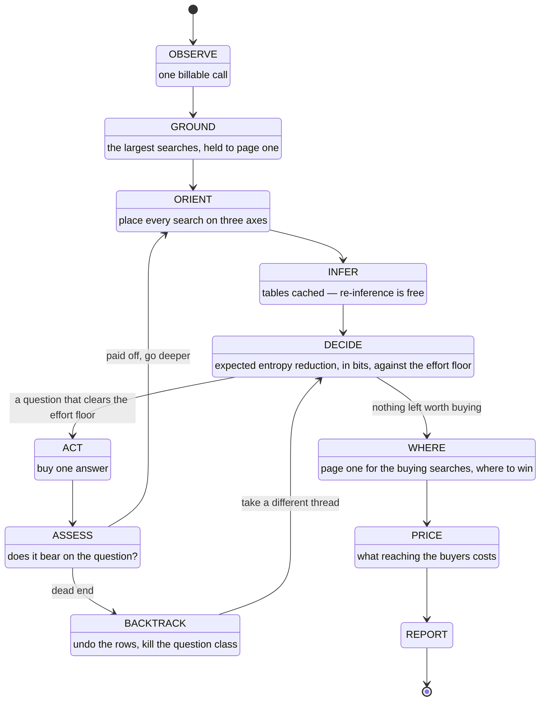
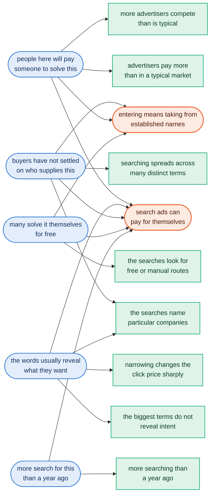

# The whole flow

Three views of the same machine. The first is what happens end to end; the
second is the control loop that decides what to buy; the third is the
network that turns measurements into an answer.

Every node is coloured by **who does the work**, because that division is
the method:

- **orange — the paid API.** DataForSEO, and nothing else. A keyword call
  is about $0.09 whether it carries one keyword or a thousand; a first page
  of Google is $0.002; Labs difficulty is billed per search.
- **blue — Jev.** Every judgment. No language model appears anywhere.
- **green — code.** Arithmetic, string handling, budgets, and rendering
  sentences from templates. No judgment.

---

## 1. End to end

```mermaid
flowchart TB
  IN(["keyword · country · who is asking"]):::io

  IN --> SERP
  SERP["search results for the seed<br/>who actually ranks"]:::money
  SERP --> QSELL{{"what kind of organisation is this?<br/>sells it · sells something wider ·<br/>lists it · writes about it · buys it"}}:::jev
  QSELL -->|"a focused seller"| SITE
  QSELL -->|"nobody sells here —<br/>itself the finding"| EXPAND

  subgraph OBS["OBSERVE — the keyword calls"]
    direction LR
    SITE["for-site<br/>a live business's whole footprint<br/>619 rows where a word gave 31"]:::money
    EXPAND["expand<br/>Google's idea list for a string<br/>collapses on a niche seed"]:::money
    PRICEP["price<br/>up to 1000 synthesised guesses<br/>each word order asked once"]:::money
    FCAST["forecast<br/>what the biddable searches deliver"]:::money
  end

  SITE --> QREL{{"is this search about what<br/>this market deals in?<br/>every door in, not just harvests"}}:::jev
  EXPAND --> QREL
  PRICEP --> QREL
  QREL -->|"no, or never asked"| DROPPED["discarded before it can<br/>outvote the market's own words<br/>an unvetted row is not evidence"]:::code
  QREL -->|"yes"| OUTV{"larger than the rest<br/>of the market combined?"}:::code
  OUTV -->|"no"| HEAD
  OUTV -->|"yes"| QOUT{{"stated in words: do most people<br/>typing it mean this market?"}}:::jev
  QOUT -->|"yes: its own head term"| HEAD
  QOUT -->|"no: drawings, 1.83M a month"| DROPPED
  HEAD{"among the market's largest searches,<br/>or its most valuable buying ones?"}:::code
  HEAD -->|"no"| ROWS
  HEAD -->|"yes"| PAGE["page one<br/>$0.002 a search, eight at a time"]:::money
  PAGE --> QGROUND{{"judging by what Google shows,<br/>is this search about this market?"}}:::jev
  QGROUND -->|"yes"| ROWS
  QGROUND -->|"no: top modelling, civil3d"| DROPPED
  ROWS["rows: volume · click price · bids · 48-month series"]:::code
  ROWS --> ADDR["add_rows<br/>collapse word-order permutations<br/>and Google's close variants"]:::code
  ADDR --> GRAPH[("keyword graph")]:::code

  GRAPH --> MINE["mine n-grams and entity candidates<br/>volume-weighted, seen in 2+ keywords"]:::code
  MINE --> QPHRASE{{"a thing, a qualifier, or noise?<br/>is this word a company?"}}:::jev
  QPHRASE --> TOPICS["topics, minus brands and fragments"]:::code

  GRAPH --> CONT["containment: is the topic literally in the keyword?"]:::code
  CONT -->|"exactly one match"| PLACED["placed for free"]:::code
  CONT -->|"none, or several"| QTOPIC{{"which is this search about?"}}:::jev
  TOPICS --> CONT
  GRAPH --> QJOB{{"what is this person trying to do?<br/>8 fixed options"}}:::jev
  GRAPH --> QOFF{{"what kind of answer would satisfy them?<br/>service · software · product · information"}}:::jev
  QJOB --> DECIS["decisive? winner ≥ 2x runner-up<br/>if not, held out and reported"]:::code
  QOFF --> DECIS
  QTOPIC --> DECIS
  PLACED --> CELLS
  DECIS --> CELLS[("cells: topic × job,<br/>and rows by offering")]:::code

  CELLS --> STATS["statistics: click price weighted by searching,<br/>branded share, year on year, seasonality, spread"]:::code
  STATS --> READ["readings — state each number plainly"]:::code
  READ --> QOBS{{"is that a lot, for a market?"}}:::jev
  QOBS --> EVID["virtual evidence"]:::code

  QCPT{{"63 CPT rows, one request<br/>cached, so re-inference is free"}}:::jev --> NET
  EVID --> NET[("Bayes net<br/>exact enumeration, 32 states")]:::code
  NET --> VERD["posteriors + attribution:<br/>what moved each conclusion"]:::code
  NET --> EIG["expected entropy reduction<br/>per open question"]:::code

  CELLS --> GEN["generate every claim the shape permits,<br/>contradictory pairs included, and the contrasts:<br/>the money / growth / open ground is in A, not B.<br/>code checks each premise holds as printed"]:::code
  PAGE --> CLUST["buying searches grouped by<br/>three shared top-ten results"]:::code
  CLUST --> QKIND{{"what is each result? specialist ·<br/>household name · directory · article ·<br/>forum or social · off-target"}}:::jev
  QKIND --> SPLIT["clicks split by position;<br/>open value = buyer money × share<br/>on pages not built for it"]:::code
  LABS["Labs difficulty · share of voice"]:::money --> WIN
  SPLIT --> WIN["where to win: start here · weak spots ·<br/>lead cost by offering · who owns ·<br/>share of search · switching · patterns · new demand"]:::code
  GEN --> QADJ{{"fair reading of the measurements?<br/>which of two accounts?<br/>still true with its subject swapped?<br/>guessable from the name alone?<br/>does it change a decision, by a majority?"}}:::jev
  WIN --> QADJ
  QADJ --> KEPT["survivors"]:::code
  KEPT --> QRANK{{"which would change what they do most?<br/>groups of 8, then the winners"}}:::jev
  QRANK --> FIND["ranked findings"]:::code

  KEPT --> FOLLOW["follow-up table:<br/>the question each kind of finding raises"]:::code
  FOLLOW --> EIG
  EIG -->|"best question clears<br/>the effort floor, in bits"| PRICEP
  EIG -->|"nothing left worth buying"| FCAST
  PRICEP -.-> QASSESS{{"does what came back<br/>bear on the question asked?"}}:::jev
  QASSESS -->|"yes — go deeper"| GRAPH
  QASSESS -->|"no"| BACK["discard its rows,<br/>drop that whole class of question"]:::code
  BACK --> GRAPH

  FCAST --> COST["clicks available · what each costs ·<br/>what a budget buys"]:::code
  FIND --> REPORT
  COST --> REPORT
  REPORT(["insights.md — the insights, most valuable first,<br/>and one line on what paid search can buy"]):::io
  VERD --> DATA
  GEN --> DATA
  GRAPH --> DATA
  SPLIT --> DATA
  DATA(["data/ — keywords · offerings · topics · opportunities ·<br/>page one · share of voice · tested · series · trail ·<br/>network · forecast · run"]):::io

  classDef money fill:#fdeae1,stroke:#eb6834,stroke-width:1.5px,color:#4a1d0c;
  classDef jev fill:#e4edfb,stroke:#2a78d6,stroke-width:1.5px,color:#10305c;
  classDef code fill:#dff3e8,stroke:#1baf7a,stroke-width:1.5px,color:#0b3b2a;
  classDef io fill:#f2f1ef,stroke:#898781,stroke-width:1.5px,color:#2b2a27;
```

---

## 2. The control loop

A person chasing a hunch knows when the trail has gone cold. So does this:
when a probe's results do not bear on the question it was bought to answer,
the keywords it brought in are **discarded** and every other question of the
same kind is dropped. Keeping the tangent would crowd out the next batch of
judging and drag the market's medians toward a market nobody asked about.

---

## 3. The network

Latent properties are what a reader wants to know and no instrument
measures. Observed nodes are what keyword data sees. Decisions hang at the
bottom, which is why nothing depends on them.

Every table row is one Jev question — *"given that people here will pay and
the words do not reveal intent, can search ads pay for themselves?"* — and
all 63 fit in one request. The structure was audited rather than assumed:
asked which property each measurement is evidence about, Jev agreed with six
of eight hand-drawn edges and corrected two, both correctly, for $0.000078.

Measurements enter as **virtual evidence** rather than as true or false,
because "0.8 sure this is an expensive market" is the honest input and
forcing it through a threshold would put an invented constant back into the
method. Inference enumerates the five latent roots — thirty-two states —
exactly, in pure Python.
